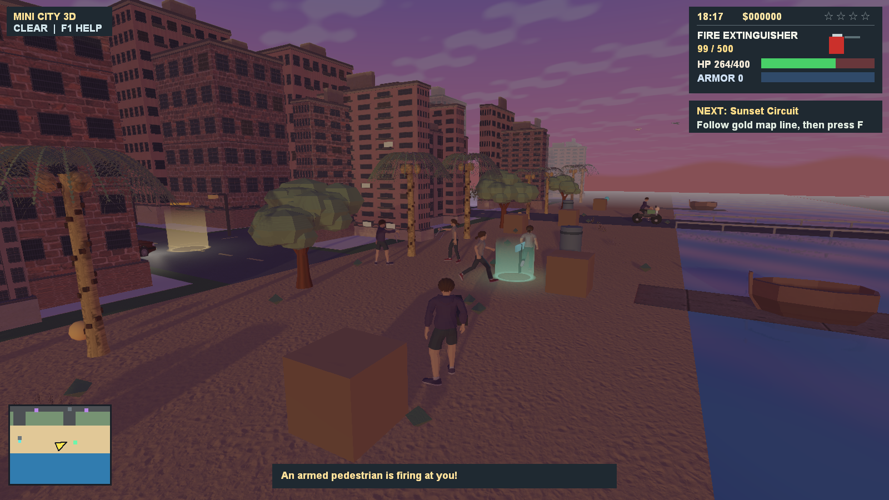
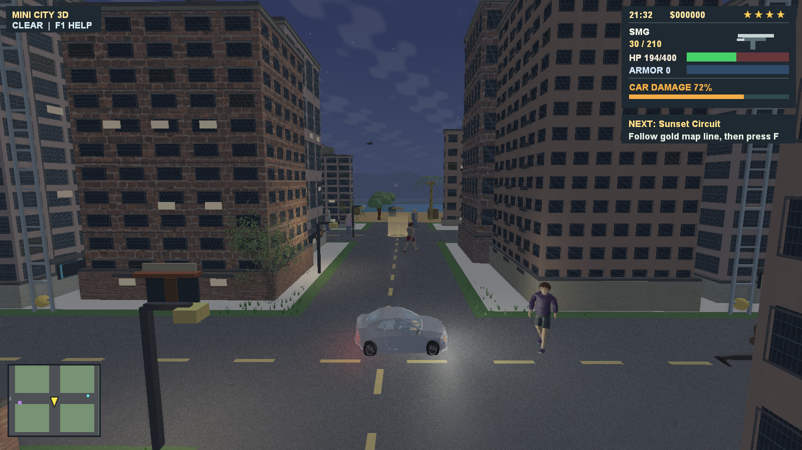
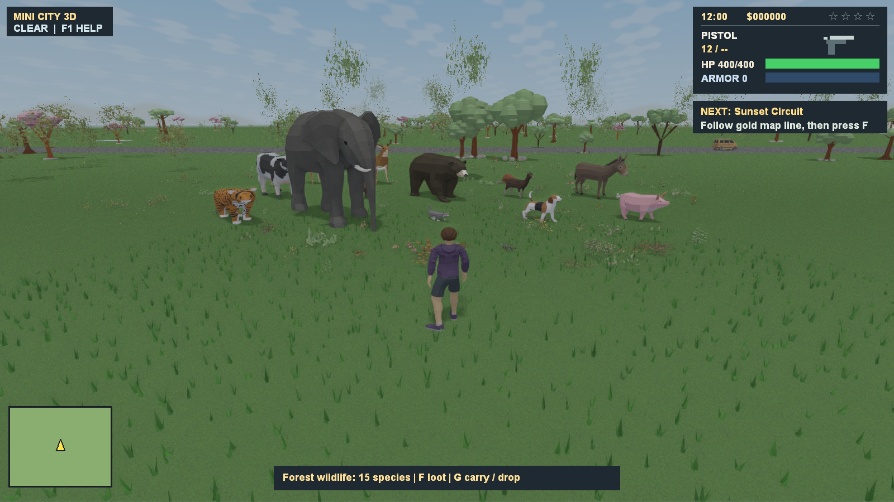
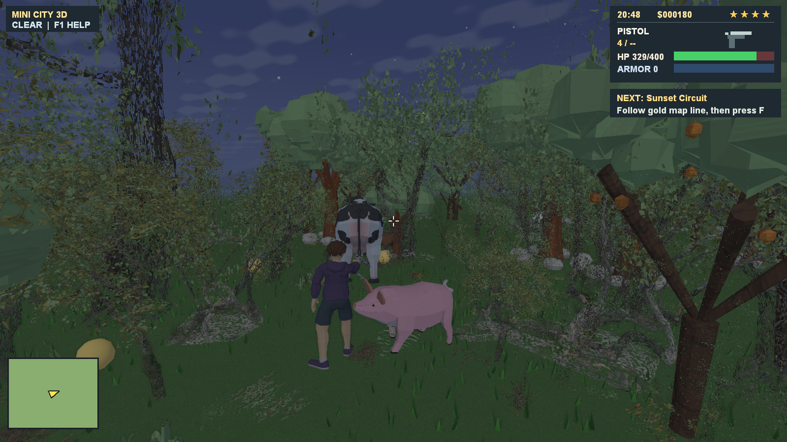
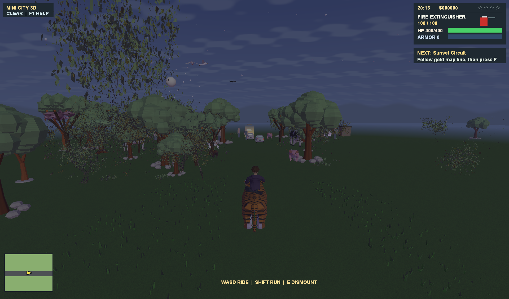
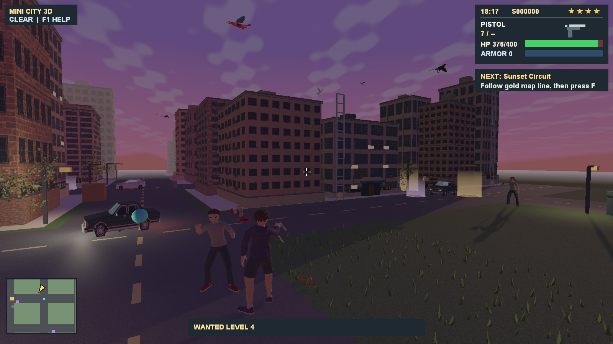
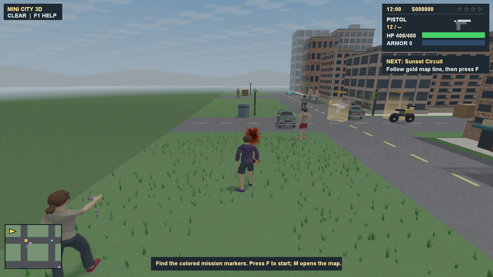

# Mini City 3D

A playable Windows city sandbox written in C++17, with **Direct3D 11**, **Jolt Physics**, and **XAudio2**. Explore two cities, a beach and harbor, countryside forests, snowfields, desert, savanna, and a Marina Part-inspired waterfront district.

The project is an evolving prototype. Implementation and verification status are tracked in [idea.md](idea.md) and the [graphics upgrade plan](graphics-upgrade-plan.md).

## Contents

- [Features](#features)
- [Screenshots](#screenshots)
- [Build and run](#build-and-run)
- [Controls](#controls)
- [Animals and destructible trees](#animals-and-destructible-trees)
- [Tests and visual previews](#tests-and-visual-previews)
- [Packaging](#packaging)
- [Project layout](#project-layout)
- [Assets and attribution](#assets-and-attribution)
- [Current limitations](#current-limitations)

## Features

- **World:** 16,800 x 16,800 world units, connected roads, a river bridge, biome hubs, shops, houses, and a waterfront neighborhood with piers and boats.
- **Rendering:** imported textured meshes, PBR material ranges, HDR lighting, day/night cycles, sun and selected local-light shadows, bloom, SSAO, screen-space reflections, and selectable FXAA/TAA.
- **Animation:** runtime skeletal clips for humanoids, GPU deformation for ordinary humanoid clips, procedural seated/swimming/climbing poses, and visible Jolt pedestrian ragdolls.
- **Physics:** a capsule player controller, nearby pedestrian controllers, vehicle chassis with suspension, boat buoyancy, movable props, animal bodies, solid tree trunks, and physical tree fragments.
- **Vehicles:** cars, sports cars, motorcycles, boats, visible occupants, headlights, contact-based crash damage, repairs, drifting, and empty-vehicle coasting.
- **Wildlife:** 15 animal species, rideable elephants and tigers, and five bird species. Animals wander, play, flee, retaliate, and hunt according to species.
- **Gameplay:** 17 weapons and tools, six main missions, four regional missions, wanted levels, police, traffic, driver retaliation, civilian conversations and fights, looting, shops, house ownership, and garages.
- **Environment:** changing weather, rain and snow, fire spread, burning trees and vehicles, swimming, ladders, and tree climbing.
- **Persistence:** saved progression, inventory, ownership, wildlife damage and loot, tree destruction, and graphics/control/audio settings.

## Screenshots

**Waterfront at sunset**



**Driving through the city at night**



**Countryside wildlife**



**Animals in the forest**



**Riding a tiger**



**City combat**



**Hit effects**



## Build and run

### Requirements

- Windows with a Direct3D 11-capable graphics device.
- Visual Studio 2022 or 2026 with **Desktop development with C++** and a Windows SDK, or a compatible LLVM/Clang toolchain with Ninja.
- CMake 3.20 or newer. The build script can use the CMake installation bundled with Visual Studio.
- Git and the pinned **Jolt Physics v5.6.0** submodule.

### Quick start

From a checkout of this repository:

```powershell
git submodule update --init --recursive
./build.ps1 -RunTests
./MiniCity3D.exe
```

`build.ps1` configures the compiler environment, builds the Direct3D game and test executables, copies runtime assets and data, runs tests when requested, and places `MiniCity3D.exe` in the repository root. Close a running root executable before rebuilding it.

To build without running tests:

```powershell
./build.ps1
```

To choose a different output executable:

```powershell
./build.ps1 -OutputPath 'build-output/MiniCity3D.exe'
```

Create the destination directory first and keep `assets/` and `data/` beside a relocated executable. The build directory already contains both folders.

### CMake directly

For a Visual Studio 2022 installation:

```powershell
cmake -S . -B build -G 'Visual Studio 17 2022' -A x64 -DBUILD_TESTING=ON
cmake --build build --config Release --parallel 4
ctest --test-dir build -C Release --output-on-failure
./build/Release/MiniCity3D.exe
```

CMake copies `assets/` and `data/` beside the game. Baked runtime assets are included; Python and Blender are needed only when rebuilding or converting art.

### Startup feedback

The Direct3D executable immediately opens a loading window with a progress bar, current stage, and elapsed time. It remains responsive while graphics initialize; closing it cancels at the next startup checkpoint. The game appears after its first frame is prepared. `--smoke` runs keep the loading window hidden.

Startup prepares regional meshes and textures in advance to avoid uploads interrupting travel. Independent image decoding, mipmap generation, and graphics shader compilation now use a bounded CPU worker pool. The default uses up to four workers, reserving a logical CPU for the main thread when possible. GPU uploads and renderer cache updates remain on the main thread, and loading workers finish before gameplay starts. Closing the loader cancels pending work and joins the workers before cleanup.

Use `--loader-workers=1` for the serial reference, or `--loader-workers=2` through `--loader-workers=8` to select a worker count. Each stage and total startup time are logged in `MiniCity3D.log`, including decode/mipmap/upload timings and actual peak concurrency. `--validate-loading` additionally checksums the prepared textures and shader bytecode; hashing adds work, so leave it off for performance measurements. Measured results and verification are in [threading evidence](evidence/threading-20260928/README.md).

To repeat matched startup measurements (three interleaved runs per worker count):

```powershell
./tools/measure_threading.ps1
```

`-Route` runs the six-scene 3,600-frame 1080p benchmark, while `-Travel` checks regional jumps. Smoke runs use a fixed random seed. The benchmark reports scene preparation, CPU deformation, grass rebuilds, uploads/culling, draw/HUD submission, and presentation separately.

During gameplay a persistent pool also handles large CPU character/ragdoll deformation loops and grass-cache rebuild rows. Workers read the frame's unchanged world state and write separate preallocated output slots or private rows. The main thread joins them before merging results, uploading, or updating simulation again. Small deformation loops remain inline; ordinary humanoid clip deformation still runs on the GPU. `--scene-workers=1` selects serial scene preparation, and overrides accept 1–8 workers. Jolt physics and gameplay updates remain single threaded.

To compare runtime scene workers while holding loading at four workers:

```powershell
./tools/measure_threading.ps1 -CompareScene -Travel -Workers 1,4
./tools/measure_threading.ps1 -CompareScene -Route -Repeats 1 -Workers 1,4
```

The game embeds an original city icon at 16, 24, 32, 48, 64, 128, and 256 pixels for Explorer, the taskbar, and window captions. The resource is in `assets/app/`; regenerate it with `./tools/build_game_icon.ps1`.

`MiniCity3D` is the actively developed Direct3D target. The existing OpenGL fallback remains available through `./build.ps1 -OpenGL` as `MiniCity3DGL.exe`.

## Controls

These are the default bindings. Movement, sprint, vehicle interaction, sensitivity, and inverted mouse look can be changed under **Esc > Controls**.

| Input | Action |
| --- | --- |
| W / A / S / D | Move, drive, or ride an animal relative to the camera |
| Shift | Run on foot or while riding |
| Hold Alt | Walk slowly |
| Left Ctrl | Toggle crouch |
| Space | Jump; handbrake while driving |
| S while driving | Brake or reverse |
| Mouse | Rotate the camera |
| Hold right mouse button | Aim |
| Left mouse button | Fire or use the selected melee weapon |
| Space + left mouse button without aiming | Unarmed punch or jump strike |
| R | Reload; restart after death |
| 1-9 / Q | Select or cycle unlocked weapons and tools |
| E | Enter/exit a vehicle; mount/dismount a nearby tiger or elephant |
| F / Tab | Use the selected nearby action / cycle nearby actions |
| G | Carry or drop a corpse |
| F near a ladder or climbable tree | Start climbing; W/S climb, F releases, Space jumps from a tree |
| H while driving | Toggle car or motorcycle headlights |
| C | Cycle first-person, third-person, and overview cameras |
| B / mouse wheel | Telescope / telescope or sniper zoom |
| M | Toggle the map |
| T | Advance time by one hour |
| Esc | Pause, settings, Save, and Load |
| F1 | Toggle the full controls overlay |
| F3 | Toggle performance information |
| F4 | Open the debug menu |
| F11 | Save a PNG screenshot |

Shops and house menus use arrow keys, Enter, and Esc. In debug fly mode, Space/Ctrl move vertically and Shift increases speed.

### Getting started

A car starts near the player. Follow the gold map line to the next mission marker and press **F**. Cyan markers provide weapons, green markers identify shops, purple markers identify houses for sale, and blue markers identify owned houses. Orange markers identify regional missions.

Graphics, controls, and volume are saved in `settings.ini`. Save/Load use `savegame.ini`. These files, `MiniCity3D.log`, and the `screenshots/` directory are located beside the executable. Mission rewards and weapon pickups also trigger saves.

In the DX11 game, autosaves capture a snapshot on the gameplay thread and write it on a dedicated worker. One active write and one pending snapshot bound the queue; newer requests replace an unwritten pending snapshot. The worker writes a complete temporary INI and replaces the destination after flushing it. Manual Save waits for completion, Load waits for pending writes, and normal shutdown drains them. Failed autosaves report a message while preserving the previous save. Sound effects reuse PCM prepared during startup, including four takes for noise-based sounds, and held-weapon graphics are prepared before gameplay. See [pickup hitch measurements](evidence/pickup-hitches-20260928/README.md).

## Animals and destructible trees

Twenty countryside groves contain tigers, elephants, cats, dogs, pigs, cows, capybaras, bears, goats, donkeys, roe deer, deer, weasels, beavers, and mice. Grove centers use X = 3000/4000/5000/6000/7000 and Z = 1300/3900/6400/9000. Each grove has up to eight animals with stable save IDs; distant wildlife sleeps until approached.

- Living animals have Jolt collision bodies. Characters meet their bodies, and vehicle impacts can damage or kill them. Very small animals can be stepped over.
- Press **E** near a living tiger or elephant, then use **WASD** and **Shift**. Movement checks the animal's long, narrow footprint so forest gaps remain usable. Mounting recovers positions from older saves that overlap a trunk.
- Ridden animals can cross roads and stop at water, buildings, trunks, props, vehicles, and other animals. **E** dismounts into clear space. Mounted combat is disabled; loading returns the rider to the ground.
- Tree trunks block characters and vehicles. Low-speed car impacts stop at the trunk; sufficiently hard impacts break the tree into trunk, branch, and foliage pieces that fall, collide, and settle. Breakage depends on closing speed, vehicle mass, tree scale, and tree health.
- Tree fragments are temporary, capped physics objects. The destroyed tree remains a stump, and its destruction is saved.
- Use weapons or explosives to hunt, **F** to loot once, and **G** to carry/drop a corpse. Wildlife damage, death, position, and loot state persist across saves. Carrying prevents firing and reloading.

Animal gait, play, attack, and corpse poses are procedural. The roe-deer model is an adapted fawn; see [animal attribution](assets/models/ANIMALS.md).

## Tests and visual previews

Run the complete build and CTest suite:

```powershell
./build.ps1 -RunTests
# Equivalent wrapper:
./test.ps1
```

The 12 CTest entries cover the main simulation, wildlife, birds, drivers, vehicle collisions, pedestrians, traffic, navigation, assets, texture mip generation, reflection probe data, and loading-window responsiveness, cancellation, lifecycle, and embedded icon sizes. Collision scenarios exercise animal bodies, riding through narrow gaps, old-position recovery, low/high-impact tree crashes, physical fragments, and collider cleanup.

To rerun focused scenarios after building with Ninja:

```powershell
ctest --test-dir build-msvc-ninja -C Release -R 'wildlife_scenarios|vehicle_collision_scenarios' --output-on-failure
```

Visual smoke flags stage repeatable scenes and exit after rendering:

```powershell
./MiniCity3D.exe --smoke --day --animals --animal-ride --animal-ride-move --screenshot
./MiniCity3D.exe --smoke --day --animals --animal-ride --animal-ride-move --tiger --screenshot
./MiniCity3D.exe --smoke --day --tree-impact-preview --1080p --screenshot
./MiniCity3D.exe --smoke --day --tree-impact-preview --settled --1080p --screenshot
./MiniCity3D.exe --smoke --night --driver-preview --damaged --screenshot
./MiniCity3D.exe --smoke --day --marina --1080p --screenshot
```

Smoke mode uses staged test state. To record performance, use `--smoke --benchmark --1080p --day`, or `--smoke --benchmark-route --1080p` for the deterministic six-segment route. Timings are written to `MiniCity3D.log`; local measurements do not establish performance on other hardware.

## Packaging

```powershell
./package.ps1
```

This builds, copies cooked assets, data, attribution records, and the Jolt license, runs packaged graphical smoke checks, and creates a ZIP under `dist/`. Raw model sources are excluded.

Use `./package.ps1 -SkipBuild` to package an existing build. `-SkipSmoke` skips graphical checks; `-IncludeOpenGL` includes an existing fallback executable.

The [Windows workflow](.github/workflows/windows-release.yml) builds and tests pull requests and pushes to `main`. It uploads a downloadable package; successful `main` pushes also publish a prerelease tagged `build-<run number>`. Hosted CI skips graphical package smoke runs. A manual workflow run uploads an artifact without publishing a release.

## Project layout

| Path | Purpose |
| --- | --- |
| [`src/`](src/) | C++ simulation, rendering, input, audio, and physics |
| [`tests/`](tests/) | Deterministic scenarios and asset/pipeline checks |
| [`data/`](data/README.md) | Versioned gameplay and world configuration |
| [`assets/models/`](assets/models/) | Original sources, baked meshes, textures, and provenance |
| [`assets/materials/`](assets/materials/) | Material textures and licenses |
| [`assets/lighting/`](assets/lighting/README.md) | Cooked reflection probes and lighting data |
| [`tools/`](tools/) | Asset import, conversion, generation, and cooking scripts |
| [`third_party/JoltPhysics/`](third_party/JoltPhysics/) | Pinned physics submodule |
| [`idea.md`](idea.md) | Implementation roadmap and verified milestones |
| [`graphics-upgrade-plan.md`](graphics-upgrade-plan.md) | Rendering roadmap and open work |
| [`traffic-ai.md`](traffic-ai.md) | Traffic and retaliation behavior |

The older top-down experiment is preserved in `src/prototype2d.cpp`.

## Assets and attribution

Third-party assets have individual licenses; attribution is recorded alongside their sources and baked files.

- [Model licenses](assets/models/LICENSES.md), [nature manifest](assets/models/NATURE_MANIFEST.csv), and [city manifest](assets/models/CITY_MANIFEST.csv).
- [Animals](assets/models/ANIMALS.md) and [birds](assets/models/BIRDS.md): Poly by Google assets via Poly Pizza, under CC BY 3.0, with modification notes.
- [Traffic and weapon licenses](assets/models/TRAFFIC_WEAPONS_LICENSES.md).
- [Marina Part provenance](assets/models/MARINA_PART.md) and [showcase sources](assets/models/SHOWCASE_SOURCES.md).
- [Material licenses](assets/materials/LICENSES.md) and [effect licenses](assets/effects/LICENSES.md).
- Jolt Physics: MIT license in `third_party/JoltPhysics/LICENSE`, copied into packages.

Most environment and original character/vehicle sources are CC0; consult each record when redistributing assets.

For art changes, see the [asset conversion workflow](tools/ASSET_PIPELINE.md) and [probe lighting workflow](tools/PROBE_LIGHTING.md). `python tools/convert_assets.py` rebuilds the supported runtime assets. Animal imports use `python tools/import_animals.py` with Pillow.

The large `island_tree_03.bin` and `jacaranda_tree.bin` source files are omitted from Git; their baked meshes are included. Restore those source files before recooking them:

```powershell
./tools/fetch_city_sources.ps1 -AssetIds island_tree_03,jacaranda_tree
```

## Current limitations

- Animal poses and rider seating remain procedural; animal skeletal animation and ragdolls are not implemented.
- The motorcycle uses a narrow four-wheel physics surrogate. Vehicle and impact behavior remain arcade-oriented.
- Nearby physics colliders stream around the player, while world definitions and mutable regional state still load globally.
- Instancing and LOD are integrated for supported scenery, including selected authored Marina chains; the broader asset and rendering roadmap remains incomplete.
- Ordinary humanoid clips use GPU skinning, while procedural poses and ragdolls retain CPU paths. Animated-object temporal coverage remains incomplete.
- Reflections combine screen-space techniques with bounded local probes; full off-screen scene reflections are not available. Material map coverage varies by asset.
- Wildlife navigation uses bounded steering. Dense forests, animation quality, interactive gameplay tuning, and performance across more Windows hardware need further validation.
- Automated scenarios and graphical previews do not replace a complete human mission playthrough.
