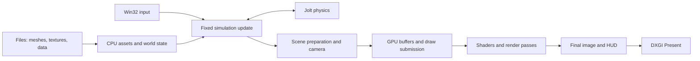
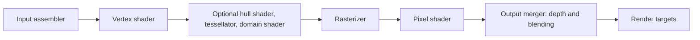

> Renderer update (2026-10-09): the main executable now uses `renderer_dx12.cpp`, `dx12_backend.cpp`, and AMD FSR2's native DX12 compute backend. The detailed DX11 API walkthrough below documents the previous backend; the scene, materials, shaders, physics and animation concepts still apply. See README's Native DX12 and AMD FSR2 section for the current build/settings path. The current backend uses a direct queue, explicit barriers, descriptor heaps, native graphics/compute PSOs and fence-protected uploads/readbacks. Two fence-protected recording slots now overlap CPU preparation with GPU execution. Each slot owns its command allocator, shader-visible heaps and retained resources. Upload pages are reused only after GPU completion and after every live buffer releases its allocation; texture descriptor tables are cached per command list. Dynamic scene uploads use the CPU worker pool and avoid intermediate copies. Readback, resize and shutdown still drain the queue. Command-list recording itself remains on the main thread.

# Mini City 3D — Technical Guide

**From asset bytes to pixels, movement, and collision in the Direct3D 11 engine.**

This guide is for an experienced software engineer who is comfortable with C++, memory layouts, concurrency, and embedded systems, but is new to DirectX and real-time graphics. It explains graphics terminology as it appears in this project and connects each concept to the code that implements it.

The subject is the actively developed **`MiniCity3D` Direct3D 11 target**. The implementation described here was inspected on **2026-09-28**. The engine is an evolving prototype; statements about current behavior are separate from future goals in [idea.md](idea.md) and [graphics-upgrade-plan.md](graphics-upgrade-plan.md). The OpenGL fallback has a different renderer and is outside this guide.

> **Start here:** a game object, a mesh, a material, and a collider are separate things. The CPU updates the game and prepares rendering data. Direct3D submits that data to the GPU. Shaders turn triangles and textures into images. Jolt resolves physical motion separately, and the renderer displays the resulting game state.

For installation, playable controls, screenshots, and packaging, use the [main README](README.md).

## Contents

1. [The engine at a glance](#1-the-engine-at-a-glance)
2. [A practical graphics vocabulary](#2-a-practical-graphics-vocabulary)
3. [Startup and the main loop](#3-startup-and-the-main-loop)
4. [Coordinates, vertices, and transformations](#4-coordinates-vertices-and-transformations)
5. [How models and materials enter the engine](#5-how-models-and-materials-enter-the-engine)
6. [GPU memory, resource views, and lifetime](#6-gpu-memory-resource-views-and-lifetime)
7. [How a scene becomes draw calls](#7-how-a-scene-becomes-draw-calls)
8. [Textures, mipmaps, and filtering](#8-textures-mipmaps-and-filtering)
9. [The Direct3D 11 pipeline](#9-the-direct3d-11-pipeline)
10. [Materials, light, shadows, and reflections](#10-materials-light-shadows-and-reflections)
11. [Post-processing and temporal rendering](#11-post-processing-and-temporal-rendering)
12. [Camera, input, and aiming](#12-camera-input-and-aiming)
13. [Animation and ragdoll rendering](#13-animation-and-ragdoll-rendering)
14. [Collision, vehicles, and the physics world](#14-collision-vehicles-and-the-physics-world)
15. [World systems, audio, and persistence](#15-world-systems-audio-and-persistence)
16. [Threads, synchronization, and performance](#16-threads-synchronization-and-performance)
17. [Diagnostics, tests, and useful experiments](#17-diagnostics-tests-and-useful-experiments)
18. [Adding or changing an item](#18-adding-or-changing-an-item)
19. [Current implementation boundaries](#19-current-implementation-boundaries)
20. [Source map and further reading](#20-source-map-and-further-reading)

---

## 1. The engine at a glance

### 1.1 What kind of engine is this?

Mini City 3D is a native Windows application written in C++17. It uses a custom renderer and gameplay code rather than a general-purpose engine such as Unreal or Unity. There is no editor-driven entity/component framework hiding the data flow: much of the world is stored in typed structures and vectors under the `game` namespace.

| Layer | Implementation | Responsibility |
| --- | --- | --- |
| Window and input | Win32 | Window messages, keyboard state, raw mouse input, cursor capture |
| Main loop | Custom C++ | Time accumulation, fixed simulation updates, rendering |
| Gameplay | Custom C++ modules | Characters, traffic, missions, weapons, weather, wildlife, interaction |
| Physics | Pinned Jolt Physics submodule | Character collision, rigid bodies, vehicle constraints, contacts, ragdolls |
| Graphics | Direct3D 11 and DXGI | GPU resources, programmable rendering pipeline, presentation |
| Shader language | HLSL | Vertex transforms, skinning, surface shading, post-processing |
| Math | Project vector helpers and DirectXMath | Gameplay vectors and render matrices |
| Image decoding | GDI+ | PNG/JPEG files converted to CPU pixel arrays |
| HUD drawing | GDI plus Direct3D composition | Text and 2D overlays drawn into a bitmap and uploaded |
| Audio | XAudio2 | Playback of prepared PCM effects and ambient sounds |
| Asset preparation | Python and selected Blender workflows | Source conversion, runtime mesh cooking, textures, probes |
| Build and verification | CMake, PowerShell, CTest | Executables, test scenarios, asset copying, packaging |

[CMakeLists.txt](CMakeLists.txt) shows the actual source lists, compile definitions, and library dependencies. `MINI_CITY_JOLT` enables the current DX11/Jolt integration and several associated gameplay paths.

### 1.2 Think in terms of producers and consumers

An embedded analogy is useful: the CPU prepares payloads, the graphics driver schedules work, and the GPU consumes buffers using a configured processing pipeline. A draw call submits work; it does not mean all pixels have already been written when the function returns.



The important ownership distinction is between **CPU data**, such as `std::vector<Vertex>`, and **Direct3D resources**, such as `ID3D11Buffer`. Changing one does not automatically change the other. There must be a creation, upload, or GPU computation step.

### 1.3 The four identities of an item

Consider a car:

| Identity | Example contents | Changes when… |
| --- | --- | --- |
| Gameplay object | Position, angle, speed, health, driver, headlights | Simulation advances |
| Visual mesh | Vertices, indices, bounds, material ranges | Art is loaded or a visual LOD is selected |
| Render instance | Mesh reference, scale, translation, yaw, tint | A frame is prepared |
| Physics body | Chassis shape, velocity, mass, constraints | Jolt integrates motion and contacts |

Many cars can share a single mesh and texture. Each car still has independent gameplay state and a physics body. A glass mesh or occupant may produce additional render objects. The physics chassis is simpler than the visible car and does not derive collision from every rendered triangle.

## 2. A practical graphics vocabulary

| Term | Meaning in this guide |
| --- | --- |
| Vertex | One record containing position and associated attributes |
| Triangle | Three vertices, or three indices that refer to vertices |
| Mesh | A collection of triangles, bounds, and material metadata |
| Index buffer | An array of vertex numbers used to assemble triangles |
| UV | Two coordinates used to locate a sample in a texture |
| Texel | One stored texture element; a pixel is an element of the rendered image |
| Normal | A direction perpendicular to a surface, used for lighting |
| Tangent space | A local surface coordinate system for interpreting normal maps |
| Material | Rules and inputs defining how a surface responds to light |
| Shader | A program executed by the GPU for vertices, surface samples, or compute work |
| Rasterization | Determining which image samples are covered by a triangle |
| Render target | An image resource into which a rendering pass writes |
| Depth buffer | An image storing depth for visibility testing |
| Draw call | Submission of a geometry batch to the configured graphics pipeline |
| Instance | One placement of shared geometry in the world |
| Frustum | The camera's visible volume, bounded by its view and projection |
| Culling | Rejecting work that need not contribute to a pass |
| LOD | Level of detail; here, a choice of simpler geometry or texture level |
| Mipmap | A prefiltered, smaller version of a texture |
| HDR | High dynamic range; intermediate brightness can exceed 1.0 |
| BRDF | A function describing how light reflects from a surface |
| PBR | Physically based rendering; a material/shading approach |
| SSAO | Screen-space ambient occlusion, estimated from visible depth and normals |
| SSR | Screen-space reflections, estimated from the current view |
| FXAA | Image-based edge smoothing within one frame |
| TAA | Temporal anti-aliasing, combining compatible samples across frames |
| Skinning | Deforming a mesh using weighted bone/joint transforms |
| Collider | A shape used by physics or gameplay queries |

**Geometry LOD and texture mip level solve different problems.** A tree can use a coarse mesh while sampling a relatively detailed texture, or a detailed mesh while sampling small texture mips. Neither choice controls whether the tree's trunk has a collider.

## 3. Startup and the main loop

### 3.1 Startup prepares both CPU and GPU state

The application entry point is in [src/main.cpp](src/main.cpp). Its startup window reports progress and permits cancellation at checkpoints. The renderer initialization sequence in [src/renderer_dx11.cpp](src/renderer_dx11.cpp), `initRenderer()`, performs these major operations:

1. Create a Direct3D device, immediate context, and swap chain.
2. Start GDI+ and compile the HLSL programs.
3. Create pipeline state objects, render targets, depth resources, and optional skinning/shadow/timing resources.
4. Decode surface textures and generate their mip chains.
5. Read cooked meshes and animation files into CPU structures.
6. Create the immutable base-city geometry buffer.
7. Gather and deduplicate regional texture requests, prepare them with loading workers, and upload the results on the main thread.
8. Prewarm regional mesh buffers and selected held-weapon resources.
9. Load cooked HDR probe lighting and create the persistent scene worker pool.

The main program also loads settings and gameplay configuration, resets/populates the world and physics, initializes audio, restores saved progress when appropriate, and prepares the first frame before showing the game window. Read `main.cpp` for the precise ordering; renderer initialization and gameplay initialization are separate stages.

The prewarm matters: first seeing a forest or equipping a weapon should not require decoding a large image and uploading a mesh in that gameplay frame. Some caches still support on-demand creation; prewarming is an optimization, not a general background streaming/residency system.

### 3.2 Device selection

`initRenderer()` requests **feature level 11.0**. It first tries `D3D_DRIVER_TYPE_HARDWARE`, then tries **WARP**, Microsoft's software rasterizer, if hardware creation fails. The WARP path uses the DX11 renderer but can have substantially different performance.

The swap chain uses:

| Property | Current choice |
| --- | --- |
| Format | `DXGI_FORMAT_B8G8R8A8_UNORM` |
| Buffer count | 2 |
| Sample count | 1 |
| Windowed | Yes |
| Swap effect | `DXGI_SWAP_EFFECT_DISCARD` |
| Presentation interval | Normally 1; benchmark command lines select 0 |

This is the project's existing discard-model swap chain. The sample count of one means the image is not rendered with multisample anti-aliasing; its edge smoothing comes from the post-processing paths described later.

### 3.3 Fixed simulation, variable rendering

The interactive loop uses `QueryPerformanceCounter` for elapsed time. Each simulation update receives **1/60 second**, regardless of how long the previous render took.

Conceptually, the loop is:

```cpp
// Explanatory pseudocode; see main.cpp for error handling and pause behavior.
processWindowMessages();
elapsed = clamp(measuredElapsed, 0.0, 0.25);
accumulator += elapsed;                 // Only while gameplay is running.

for (steps = 0; accumulator >= 1.0/60.0 && steps < 5; ++steps) {
    update(1.0f/60.0f);
    accumulator -= 1.0/60.0;
}

if (steps == 5) accumulator = 0;        // Bound catch-up work.
renderAlpha = accumulator / (1.0/60.0);
render();
```

The five-update cap prevents an overloaded frame from causing unlimited catch-up work. Excess accumulated time is dropped and overload events are logged periodically. Pausing clears the accumulator, so unpausing does not replay all time spent in a menu.

`renderAlpha` is a fraction between simulation samples. Some rendering uses:

```text
displayedPosition = previousPosition * (1 - renderAlpha)
                  + currentPosition * renderAlpha
```

This smooths fixed-step positions when rendering more frequently. Interpolation is applied selectively; do not assume every entity, height, animation, and camera parameter has complete previous/current interpolation. Aiming and occupied-vehicle camera focus deliberately use current player position in the renderer.

## 4. Coordinates, vertices, and transformations

### 4.1 World axes and units

The game uses **Y for height** and **X/Z for horizontal position**. `Vec2` contains `x` and `z`; it is a horizontal-world vector, not a screen-space vector. `Vec3` adds `y`.

Gameplay facing is defined in [src/game.h](src/game.h):

```cpp
forward(angle) = { cos(angle), sin(angle) }; // Components are X and Z.
```

Therefore angle zero faces positive X. The normal gameplay renderer uses `XMMatrixLookAtRH` and `XMMatrixPerspectiveFovRH`: **right-handed view/projection conventions**. Direct3D can support different coordinate conventions; this project makes an explicit choice. Probe capture is a deliberate exception and uses left-handed cube-face views/projections.

Coordinates are **game units**, not a documented metre-based physical scale. For example, the standing character shape and movement speeds are expressed in tens or hundreds of units, and gravity is `-700` units/s². Avoid importing a real-world metre value unchanged merely because Jolt supports physical quantities.

The original starting-city constants in `game.h` describe a 2,400 × 2,200 area. The broader playable region is **16,800 × 16,800**, defined in [src/regions.h](src/regions.h). Both appear in code because the original district is part of a larger map.

### 4.2 The exact ordinary vertex layout

[src/dx11_assets.h](src/dx11_assets.h) defines:

```cpp
struct Vertex {
    float x, y, z;       // Position.
    float nx, ny, nz;    // Normal.
    float u, v;         // Texture coordinates.
    float r, g, b, a;    // Vertex color and alpha.
};
```

The runtime layout is **12 floats / 48 bytes**. The input layout in `createShaders()` describes the same bytes to Direct3D:

| Offset | Bytes | HLSL semantic | Direct3D format |
| ---: | ---: | --- | --- |
| 0 | 12 | `POSITION0` | `R32G32B32_FLOAT` |
| 12 | 12 | `NORMAL0` | `R32G32B32_FLOAT` |
| 24 | 8 | `TEXCOORD0` | `R32G32_FLOAT` |
| 32 | 16 | `COLOR0` | `R32G32B32A32_FLOAT` |

An input layout is a binary decoding contract. It plays a role similar to the descriptor for a peripheral/DMA data stream: offsets, formats, and stride must agree with the producer. `POSITION` is a named shader input, not a C++ member name inferred automatically.

Normals describe directions and UVs describe texture locations; neither can be recovered from position alone in the general case. Vertex color supplies tint or baked source color and can be multiplied by both texture color and instance tint.

### 4.3 Why a cube may need more than eight vertices

A vertex is the whole attribute tuple, not just a unique position. Two triangles may touch at the same position but need different normals to preserve a hard edge or different UVs across a texture seam. Those corners require separate vertex records.

An indexed mesh can reuse a record only when its required attributes agree. For a simple quad, four compatible vertex records and six indices represent two triangles. A non-indexed triangle list usually contains six records for the same quad.

### 4.4 Local space to screen space

For an instanced model, transformation proceeds as follows:

1. Start from the asset's local vertex position.
2. Subtract its horizontal bounds center and minimum Y to establish the placement origin.
3. Apply X/Y/Z scale.
4. Apply pitch when the instance uses it.
5. Apply yaw.
6. Add the instance's world translation.
7. Multiply the world position by the view and projection matrices.
8. Divide clip-space X/Y/Z by W to obtain normalized device coordinates.
9. Map those coordinates to pixels in the viewport.

`VSInstanced` contains these operations explicitly. The ordinary `VS` receives vertices that are already in world space, so it only needs the view/projection transform.

The scene shader uses `row_major float4x4` and row-vector multiplication:

```hlsl
clipPosition = mul(float4(worldPosition, 1), viewProjection);
```

The C++ code stores `view * projection` to match that convention. The skinning palette uses a different, explicitly declared matrix convention; copying scene-matrix assumptions into skinning code would be incorrect.

### 4.5 Perspective and depth

Perspective makes distant objects occupy fewer pixels. The normal camera has near plane **2** and far plane **`1250 * drawDistanceScale()`**. Visible depth is mapped to the Direct3D 0–1 range and stored for depth testing.

Depth is nonlinear under perspective. Much of its precision is concentrated close to the near plane. Two nearly coincident surfaces can compete for the same stored depth and flicker: **Z-fighting**. Road markings and ground details use small height offsets partly to avoid coincident surfaces.

The normal transform is different from the position transform. Under nonuniform scale, normals need inverse-scale compensation before rotation and normalization. `VSInstanced` and the skinning code perform this explicitly. Without it, a stretched object can receive visibly incorrect lighting even when its geometry is placed correctly.

## 5. How models and materials enter the engine

### 5.1 Source assets versus cooked assets

Artist-facing formats such as GLB, glTF, FBX, and Blender scenes can contain hierarchy, materials, skeletons, animation, and embedded images. The runtime does **not** load an arbitrary FBX or GLB directly during gameplay.

The repository uses offline tools to produce smaller, simpler runtime files under `assets/models/baked/`. The existing tools include:

| Tool | Main role |
| --- | --- |
| [tools/convert_assets.py](tools/convert_assets.py) | Existing environment/humanoid mesh and sampled-skin conversion |
| [tools/index_m3d.py](tools/index_m3d.py) | Indexed mesh processing |
| [tools/import_traffic_weapons.py](tools/import_traffic_weapons.py) | Traffic/weapon import, including supported material ranges |
| [tools/import_animals.py](tools/import_animals.py) | Species models and procedural pose assets |
| [tools/import_birds.py](tools/import_birds.py) | Bird assets |
| [tools/build_marina_assets.py](tools/build_marina_assets.py) | Marina geometry, materials, and authored LOD assets |
| [tools/convert_source.ps1](tools/convert_source.ps1) | Pinned Blender source-to-canonical-GLB workflow |

[tools/ASSET_PIPELINE.md](tools/ASSET_PIPELINE.md) explains canonical conversion and the runtime cooker's limitations. A successful canonical GLB export does not establish that all of its features can be represented by the current runtime files.

### 5.2 M3D1 and M3D2 mesh files

`loadMeshes()` in [src/dx11_assets.cpp](src/dx11_assets.cpp) reads binary `.m3d` files. The cookers write little-endian values for the Windows runtime.

| Field | M3D1 | M3D2 |
| --- | --- | --- |
| Magic | 4 bytes: `M3D1` | 4 bytes: `M3D2` |
| Vertex count | `uint32_t` | `uint32_t` |
| Index count | Absent | `uint32_t` |
| Vertex payload | `vertexCount * 48` bytes | `vertexCount * 48` bytes |
| Index payload | Absent | `indexCount * 4` bytes |
| Assembly | Consecutive vertices form triangles | Consecutive indices form triangles |

Thus M3D1 vertices begin at file offset **8**, and M3D2 vertices begin at offset **12**. For M3D2, indices follow the last vertex. Indices are 32-bit and are bound as `DXGI_FORMAT_R32_UINT`.

The loader rejects unsupported magic, zero/excessive counts, incomplete payloads, and out-of-range indices. In the main mesh path the upper limits are 3,000,000 vertices and 9,000,000 indices; indexed counts must be a multiple of three. These checks are useful format sanity checks, not a complete hardened parser for arbitrary untrusted files.

Bounds are computed by scanning positions for minimum and maximum X/Y/Z. They are used for placement, projected-size LOD, and approximate visibility spheres. They are not automatically converted into Jolt colliders.

### 5.3 How an asset is discovered

The loader combines a fixed list with discovery in selected folders. Animals and birds are enumerated; selected building/nature name prefixes are accepted. It also adds mesh names referenced by valid authored LOD catalogs.

Consequently, placing `my-new-object.m3d` in a random subfolder is not enough to make it appear. An item must be loaded under a name, referenced by scene/gameplay code or supported data, and submitted for rendering.

`mesh(name)` returns a pointer from the CPU mesh registry. `Mesh` keeps vertex/index vectors, bounds, texture paths, material ranges, and flags such as `castsShadow`, `transparent`, `alphaTest`, and `temporalStable`.

### 5.4 Textures and material sidecars

For many meshes, the loader searches for a matching `.png`, `.jpg`, or `.jpeg`. Some categories have shared naming rules: Marina buildings use a facade atlas; animal pose variants share the species image; birds share the base species texture.

A `.pbr` file can override material inputs for individual ranges. A line contains:

```text
start count roughness metallic emissive base normal orm occlusion emissiveMap [alphaMode cutoff]
```

The actual pistol sidecar begins with:

```text
0 7611 0.75 0.15 0 pistol_image1.png pistol_image0.png pistol_image2.png - - OPAQUE 0.5
```

This describes 7,611 index elements starting at zero, scalar roughness 0.75, scalar metallic 0.15, no scalar emission, and three map files. `-` means that a map is absent. Paths resolve relative to the sidecar. For a non-indexed mesh, `start` and `count` address vertices instead of indices. **These values are element offsets/counts, not byte offsets or triangle counts.**

The optional supported alpha modes are `OPAQUE` and `MASK`; a masked material discards samples below its cutoff. The loader checks that ranges fit the mesh. General imported `BLEND` materials and the complete glTF material-extension set are not represented by this sidecar.

### 5.5 Authored geometry LOD catalogs

A `.lod` file is text, with `MCLOD1` followed by four mesh names and decreasing pixel thresholds. For example, [marina-wave.lod](assets/models/baked/marina/marina-wave.lod):

```text
MCLOD1
marina/marina-wave 500
marina/marina-wave-lod1 240
marina/marina-wave-lod2 80
marina/marina-wave-lod3 0
```

The first mesh must be the base name and the final threshold must be zero. The runtime checks names, thresholds, the presence of referenced geometry, matching bounds, and decreasing element counts before publishing a chain. Material/texture consistency also needs asset verification; the chain reader does not establish complete material equivalence. Other content still uses two-level detail/proxy choices, including generated coarse nature or person shapes.

### 5.6 Animation files

Humanoid `.m3s` files use the current magic **`M3S3`**:

| Part | Contents |
| --- | --- |
| Header | Magic, vertex count, joint count, clip count |
| Skin vertices | Ordinary 48-byte vertex, four `uint8_t` joint IDs, four float weights: 68 bytes |
| Joint mapping | One body-part ID per joint for procedural/ragdoll association |
| Each clip header | 16-byte name, frame count, duration |
| Each clip payload | One 4×4 palette matrix per frame/joint and sampled right-hand positions |

The loader currently accepts up to 255 joints, up to 12 clips, and up to 128 sampled frames per clip. These are sampled deformation palettes, not a full runtime animation hierarchy with local translation/rotation/scale tracks. Section 13 explains how the engine evaluates them.

## 6. GPU memory, resource views, and lifetime

### 6.1 Device versus context

`ID3D11Device` creates resources and state objects. `ID3D11DeviceContext` binds them, updates them, and submits rendering/compute commands. This project keeps GPU creation, uploads, cache publication, and immediate-context work on the main thread. CPU workers produce private data first. Microsoft's [device/context overview](https://learn.microsoft.com/en-us/windows/win32/direct3d11/overviews-direct3d-11-devices-intro) documents the API separation and threading rules.

Examples:

```cpp
device->CreateBuffer(...);             // Allocate a resource.
context->IASetVertexBuffers(...);      // Bind an input.
context->VSSetShader(...);             // Select a program.
context->DrawIndexedInstanced(...);    // Submit work using the current state.
```

Pipeline state persists between calls. A later draw sees whatever bindings are current, so passes explicitly set or clear the relevant state.

### 6.2 Resource usage is an access contract

| Usage | Project examples | Access pattern |
| --- | --- | --- |
| `IMMUTABLE` | Shared mesh/index buffers, loaded mipmapped textures, probe data | Initialized at creation; contents remain fixed |
| `DYNAMIC` | Per-frame CPU geometry, instance data, HUD texture | CPU writes; GPU reads |
| `DEFAULT` | Render targets, constant buffers, compute-skin output | GPU-oriented use; updates/copies through context operations |
| `STAGING` | Screenshot and validation readback | CPU access for copying data back; not a normal rendering input/output binding |

These are API usage constraints, not guarantees of a particular physical RAM location. Integrated and discrete GPUs have different memory systems. Microsoft's [resource overview](https://learn.microsoft.com/en-us/windows/win32/direct3d11/overviews-direct3d-11-resources) provides the underlying buffer/texture model.

### 6.3 Map, copy, unmap

Dynamic data generally follows:

```cpp
context->Map(buffer, 0, D3D11_MAP_WRITE_DISCARD, 0, &mapped);
std::memcpy(mapped.pData, preparedData, preparedBytes);
context->Unmap(buffer, 0);
```

`WRITE_DISCARD` invalidates the old contents: the new frame must write every byte it expects to use. It allows the runtime to arrange fresh backing storage when needed, but it is not a promise that mapping can never stall. See [D3D11_MAP](https://learn.microsoft.com/en-us/windows/win32/api/d3d11/ne-d3d11-d3d11_map).

The renderer grows dynamic buffers when capacity is insufficient and reuses them otherwise. Immutable meshes are cached by mesh pointer, so a repeated tree instance does not upload all tree vertices every frame.

For mapped textures, **`RowPitch` can exceed `width * bytesPerPixel`**. The HUD upload and screenshot path copy row by row. Assuming a tightly packed GPU row is a classic source of corruption. Microsoft's [mapped-subresource reference](https://learn.microsoft.com/en-us/windows/win32/api/d3d11/ns-d3d11-d3d11_mapped_subresource) defines the pitch fields.

### 6.4 Views describe how a resource is used

One texture allocation can have several views:

| View | Expanded name | Use |
| --- | --- | --- |
| SRV | Shader resource view | Read from a shader |
| RTV | Render target view | Write color/auxiliary outputs from rendering |
| DSV | Depth-stencil view | Depth testing or shadow-depth writing |
| UAV | Unordered access view | Compute shader writes to arbitrary elements |

The scene color texture has an RTV during scene rendering and an SRV during post-processing. The depth texture uses `R24G8_TYPELESS` storage, a `D24_UNORM_S8_UINT` DSV, and an `R24_UNORM_X8_TYPELESS` SRV. Shadow storage uses `R32_TYPELESS` with a `D32_FLOAT` DSV and `R32_FLOAT` SRV.

“Typeless” lets different compatible views interpret a resource. It does not imply untyped shader access. A shader still reads values according to the bound view's format.

The engine clears conflicting bindings when switching resources from output to input or input to output. The compute-skin output, for example, must be unbound from vertex input before writing through a UAV, and its UAV must be unbound before drawing from it.

### 6.5 COM lifetime and teardown

Direct3D objects are COM interfaces with reference counting. The renderer's `release()` helper calls `Release()` and sets the pointer to null. Shared references use `AddRef()` where appropriate. Resource caches keep objects alive while meshes can reuse them.

On resize, size-dependent targets are released and rebuilt. Probe/mesh assets have a different lifetime and do not need to be regenerated just because the window changed size. Shutdown joins CPU work and releases graphics resources and HUD/GDI resources.

If `Present()` fails, the renderer logs the HRESULT and `GetDeviceRemovedReason()`, sets `deviceLost`, and stops submitting frames. It reports device loss; it does not currently implement a complete device-recreation loop.

## 7. How a scene becomes draw calls

### 7.1 Three geometry paths converge in one renderer

`buildScene()` in [src/dx11_scene.cpp](src/dx11_scene.cpp) prepares the current frame from game state. Rendering uses three principal geometry paths:

| Path | CPU output | GPU storage | Typical use |
| --- | --- | --- | --- |
| Static/dynamic world triangles | Material-group vertex arrays | Immutable base-city buffer or dynamic frame buffer | Ground, roads, procedural surfaces, CPU-deformed poses |
| Shared model instances | `ModelInstance` records | Cached mesh/index buffers plus a dynamic instance buffer | Buildings, trees, cars, props, grass, effects |
| GPU-skinned humanoids | Palettes and `SkinInstance` records | Immutable skin inputs plus compute-generated output buffers | Ordinary humanoid animation clips |

The base city has an immutable geometry buffer built once by `buildStaticScene()`. The larger regional terrain and other camera-dependent geometry can still be produced during scene preparation. “Static-looking” does not necessarily mean “stored only once in an immutable buffer.”

### 7.2 Material groups

The scene has 16 material buckets. A bucket is a way to share draw/shading settings; it is not a gameplay category system.

| Group | Typical role |
| ---: | --- |
| 0 | Basic colored geometry |
| 1 | Texture-atlas geometry |
| 2 | Buildings and generic textured models |
| 3 | Water, with water-specific normal and roughness behavior |
| 4 | Nature, foliage, bark |
| 5 | Humanoids/fabric-associated shading |
| 6 | Vehicles/metal-associated shading |
| 7 | Asphalt/roads |
| 8 | Sand/ground |
| 9 | Grass |
| 10 | Marina facade atlas |
| 11 | Paving/concrete details |
| 12 | Urban building surfaces |
| 13 | Transparent effects/glass path |
| 14 | Emissive geometry |
| 15 | Wet-road/puddle details |

`pbrForGroup()` supplies default scalar material values. Per-range PBR metadata can override them. Several branches inspect group numbers directly, so changing a group can change texture projection, roughness, snow, emission, tessellation, or temporal behavior.

### 7.3 Instancing: one mesh, many placements

Each `ModelInstance` contains a source mesh, material group, scale, yaw, translation, local origin, color tint, and optional pitch. It avoids copying the mesh into world-space CPU vertices for each placement.

`prepareInstances()` packs this into **64-byte `InstanceData` records**, four `float4` values:

| Vector | Packed contents |
| --- | --- |
| `a` | Scale X/Y/Z, cosine of yaw |
| `b` | Sine of yaw, world X/Y/Z |
| `c` | Local center X, minimum Y, center Z, sine of pitch |
| `tint` | Tint R/G/B, cosine of pitch |

Input slot 0 reads mesh vertices. Input slot 1 reads instance records with `D3D11_INPUT_PER_INSTANCE_DATA` and a step rate of one. The vertex shader applies the relevant instance transform to each reused mesh vertex.

Opaque instances are sorted by material and mesh so compatible neighbors form batches. Each material range then issues `DrawIndexedInstanced()` or `DrawInstanced()`. The draw's instance count controls how many placements reuse the geometry; the start-instance value addresses the batch's portion of the instance buffer.

Instancing reduces repeated uploads and draw submission overhead. It does not make the GPU rasterize only one tree when 100 trees are visible; the transformed triangles still contribute work for each placement.

### 7.4 Culling and bounds

An instance's mesh bounds become a conservative world-space bounding sphere. The radius accounts for scaled extents and includes a small margin. Camera culling compares that sphere with forward depth and horizontal/vertical view limits; an additional radius expansion avoids aggressive rejection.

Shadow passes have **their own visibility checks and instance batches**. An object outside the camera can still cast a shadow into the visible region. Therefore the shadow lists are not simply copies of the camera-visible list.

The current CPU model-instance culling is useful, but it is not a complete GPU-driven visibility system. Dynamic vertex buckets and skinned output are handled differently. There is no general occlusion-query system removing everything hidden behind buildings.

### 7.5 Projected-size geometry LOD

`model()` estimates screen size using:

```text
pixelScale = screenHeight / (2 * tan(verticalFov / 2))
estimatedPixels = max(objectWidth, objectHeight, objectDepth)
                * pixelScale / distanceToCamera
```

Settings scale this decision. Increasing screen resolution or zooming in raises projected size and may select more detailed geometry.

LOD selection uses **hysteresis**. An authored chain moves to a coarser level below roughly 88% of the current threshold, and returns to a finer level above roughly 112% of its threshold. Two-level choices also use different entry/exit distance limits. This is the same principle as a Schmitt trigger: small input changes near a threshold should not repeatedly flip state.

Some nature shadow draws use `shadowProxy` to reduce shadow geometry cost. Four-level authored Marina chains exist alongside older two-level/generated proxies. This does not imply that every asset in the roadmap has a complete authored LOD chain.

### 7.6 Transparency changes ordering and depth behavior

Opaque geometry generally writes depth, allowing nearer surfaces to hide farther ones. Transparent model instances are sorted **back to front**, by approximate instance-center distance, and submitted separately to preserve order.

The transparent pass enables depth testing but disables depth writes. Its color blend is the conventional:

```text
outputRGB = sourceRGB * sourceAlpha
          + destinationRGB * (1 - sourceAlpha)
```

Vehicle `.glass` sidecars mark selected triangles. The loader separates those into an untextured tinted glass mesh with alpha 0.18 and no shadow casting. Effects and mission markers also use transparent meshes.

Sorting whole instances does not sort every overlapping triangle. Intersecting transparent surfaces can still exhibit ordering errors. Transparent objects write only scene color in this pass, so depth/normal/indirect buffers remain those of the opaque scene.

## 8. Textures, mipmaps, and filtering

### 8.1 Loading a texture is a multi-stage operation

The relevant code is [src/dx11_texture_loading.cpp](src/dx11_texture_loading.cpp), [src/dx11_texture_mips.cpp](src/dx11_texture_mips.cpp), and `uploadTexture()` in the renderer.

```text
PNG/JPEG file
    -> GDI+ decode and LockBits
    -> tightly packed CPU BGRA8 pixels
    -> semantic-aware full mip chain
    -> D3D11_SUBRESOURCE_DATA for each level
    -> immutable Texture2D
    -> shader resource view
    -> shader samples using a sampler state
```

The loader accepts dimensions from 1 through 8,192 for these images. GDI+ source stride is respected while copying decoded rows. The prepared mip levels themselves are tightly packed: `width * 4` bytes per row.

BGRA is the byte order in CPU memory and the DXGI format. Shaders access logical `.r`, `.g`, `.b`, `.a` channels through the texture view; HLSL code does not manually swap red and blue because the stored bytes are BGRA.

### 8.2 Why mipmaps exist

Imagine a 1,024-pixel-wide texture compressed onto a 32-pixel-wide distant wall. One screen pixel covers many original texels. Taking one or two samples from the full-resolution image misses the average appearance and changes unpredictably as the camera moves. The result is aliasing: sparkle, shimmer, and unstable fine patterns.

A mip chain prefilters that image into progressively smaller representations:

| Level | Example size | Relative texel count |
| ---: | --- | ---: |
| 0 | 1024 × 1024 | 1 |
| 1 | 512 × 512 | 1/4 |
| 2 | 256 × 256 | 1/16 |
| … | … | … |
| 10 | 1 × 1 | 1/1,048,576 |

Each next dimension is `max(1, previousDimension / 2)` using integer division. Non-square textures continue until both dimensions are one. For odd dimensions, the code computes the source interval represented by each destination texel, so it does not simply discard the final source row or column.

A large square full chain takes about **4/3 of the base level's storage**. For an uncompressed 1,024² BGRA8 image, level zero is 4 MiB and the full chain is approximately 5.33 MiB, before allocation overhead and any CPU copies. This is a geometric-series estimate; thin/non-square images have a different ratio.

Direct3D treats individual mip levels as subresources. The engine supplies every prepared level at creation; it does not call GPU `GenerateMips()` for these loaded textures. See Microsoft's [subresource model](https://learn.microsoft.com/en-us/windows/win32/direct3d11/overviews-direct3d-11-resources-subresources).

### 8.3 The four texture interpretations

`dx11::texture::Kind` determines how filtering works:

| Kind | Intended data | GPU format | CPU mip treatment |
| --- | --- | --- | --- |
| `Color` | Base color, emissive color | `B8G8R8A8_UNORM_SRGB` | Decode RGB to linear light, alpha-weight average, encode RGB back |
| `MaskedColor` | Leaf/hair-like cutouts | `B8G8R8A8_UNORM_SRGB` | Color filtering plus edge dilation and approximate alpha-coverage preservation |
| `Linear` | Roughness, metallic, occlusion, packed maps | `B8G8R8A8_UNORM` | Average channel values as data |
| `Normal` | Normal directions | `B8G8R8A8_UNORM` | Average vectors, normalize direction, store coherence in alpha |

The renderer's texture cache includes the file and interpretation in its key. A file used as color cannot safely be reused through the same resource as linear material data merely because its path matches.

### 8.4 Color averaging must happen in linear light

An sRGB byte is a nonlinear encoding of light intensity. The arithmetic average of encoded black and white is about 128, but the encoded value corresponding to their average **linear** light is about 188. Averaging bytes directly makes small bright features and distant textures too dark.

The mip generator uses the piecewise sRGB transfer functions: decode RGB, combine samples in linear space, then encode the resulting RGB for storage. The sRGB GPU texture format ensures that ordinary shader reads return color in linear space for lighting.

Alpha is treated as coverage/opacity data, not decoded as sRGB. Color accumulation uses alpha weights:

```text
filteredRGB = sum(linearRGB * alpha) / sum(alpha)
filteredAlpha = sum(alpha) / sampleCount
```

The result is stored as straight color plus alpha. Transparent black RGB should not darken a bright visible edge simply because both occupy the source filter footprint.

### 8.5 Masked textures preserve silhouettes approximately

Masked geometry performs a cutoff: a sample is present or discarded. Ordinary alpha averaging can cause leaves to shrink or disappear at smaller mip levels.

For `MaskedColor`, the mip generator:

1. Fills fully transparent texels' RGB from nearby sufficiently opaque texels, without changing their alpha. This **edge dilation** reduces fringes from filtered edge colors.
2. Measures level-zero coverage using alpha at least 128/255.
3. Builds the next filtered level.
4. Binary-searches an alpha multiplier, bounded by 0–8, using 12 iterations to approach the original coverage.
5. Applies the multiplier and performs edge dilation again.

At very coarse levels, fractional coverage cannot always be represented exactly. Also, the coverage calculation uses a fixed approximately 0.5 cutoff, while runtime materials can use other cutoffs; default foliage/shadow thresholds include 0.42 or 0.35 and `.pbr` can specify its own. Thus this is an approximate preservation scheme, not exact coverage matching for every material cutoff.

Dilation also does not provide complete atlas isolation. An atlas contains neighboring image regions; filtering can still blend between unrelated tiles unless the atlas/cooker provides enough padding. The roadmap includes broader atlas and texture-cooking work.

### 8.6 Normal maps require vector filtering

A normal map stores directions encoded from roughly `[-1, 1]` into `[0, 1]`. The familiar blue-looking flat normal points along tangent-space positive Z. Averaging encoded colors without interpreting vectors would produce the wrong direction and lose information about variation.

The normal mip code:

1. Decodes normal components into signed vectors.
2. Multiplies each vector by its stored coherence; level zero starts with alpha 255.
3. Averages the vector contribution over the source footprint.
4. Stores the normalized direction in RGB.
5. Stores the averaged vector's length in alpha.

Because CPU bytes are BGRA, the fallback flat normal uses the first stored color component, blue, for positive Z. If directions nearly cancel, the code falls back to that flat direction and retains low coherence.

Coherence near one means the source directions mostly agree. Lower coherence indicates unresolved variation. The shader increases roughness using approximately:

```text
adjustedRoughness = sqrt(clamp(roughness² + (1 - coherence) * 0.5, 0, 1))
```

This broadens distant highlights and reduces specular shimmer. The normal texture's alpha is therefore **normal-variation metadata**, not transparency.

### 8.7 How the GPU chooses mip levels

For ordinary pixel-shader `Sample()` calls, the GPU derives a texture footprint from how UV coordinates vary across neighboring screen samples. Conceptually, if one pixel spans about eight texels, a mip near `log2(8) = 3` is suitable. The real selection also depends on filter mode, anisotropy, and sampler limits.

This is why mip selection is not a fixed “distance to object” table. The same texture needs different levels when an object rotates, moves, changes scale, or is viewed with a different FOV.

`--mip-view` uses `CalculateLevelOfDetail()` to colorize texture LOD, approximately blue for finer levels through red for coarser ones. It is a diagnostic of the calculated texture LOD, not a display of geometry LOD or an exact map of every anisotropic tap.

### 8.8 Filtering and addressing

| Choice | Effect |
| --- | --- |
| Bilinear filtering | Interpolates neighboring texels within a level |
| Trilinear filtering | Also blends between neighboring mip levels |
| Anisotropic filtering | Handles elongated footprints, especially roads viewed at a grazing angle |
| Wrap addressing | Repeats a texture beyond UV 0–1 |
| Clamp addressing | Extends edge texels beyond UV 0–1 |
| Comparison sampling | Compares depth values, used for shadow filtering |

World material samplers use wrap. Imported model samplers use clamp. Screen-space passes use a separate linear/clamp sampler. Shadow sampling uses a comparison sampler. These are current engine policies; arbitrary imported per-material sampler settings are not fully preserved.

`updateTextureSampler()` maps settings as follows:

| Setting | Low | Medium | High |
| --- | ---: | ---: | ---: |
| Maximum anisotropy | 4× | 8× | 16× |
| Texture-quality `MinLOD` | 2 | 1 | 0 |

Texture quality clamps the finest level that may be sampled. Low prevents use of levels 0 and 1. **All levels remain allocated.** This setting reduces sampled detail and can reduce bandwidth; it is not a residency manager that frees fine mip levels. The API meaning of these sampler fields is documented in [D3D11_SAMPLER_DESC](https://learn.microsoft.com/en-us/windows/win32/api/d3d11/ns-d3d11-d3d11_sampler_desc).

### 8.9 Three different small-image hierarchies

Do not confuse these:

| Hierarchy | Construction | Purpose |
| --- | --- | --- |
| Surface texture mips | Semantic-aware CPU filtering of PNG/JPEG pixels | Stable material sampling at different projected sizes |
| Bloom pyramid | GPU rendering into three separate smaller targets | Spread bright image regions over a broader area |
| Probe specular mips | Offline GGX prefiltering of HDR cube maps | Approximate reflection blur for different material roughness |

The current surface path uploads uncompressed BGRA8. DDS/BC7/BC5 cooking and distance-based fine-mip residency remain roadmap work.

## 9. The Direct3D 11 pipeline

### 9.1 Stages used by this renderer

Microsoft's [pipeline overview](https://learn.microsoft.com/en-us/windows/win32/direct3d11/overviews-direct3d-11-graphics-pipeline) defines the stages. In this engine the main path is:



When tessellation is disabled, the vertex shader output proceeds directly to rasterization. Compute skinning is a separate dispatch before the draw pipeline consumes its output. This renderer does not use a geometry shader or stream output for its normal scene path.

### 9.2 Input assembler: what are the bytes?

The input assembler reads bound vertex/index buffers according to the input layout and primitive topology. Most geometry uses `TRIANGLELIST`: every three elements make one triangle. Instanced draws add the second input stream described in section 7.

Fullscreen effects instead use a four-vertex `TRIANGLESTRIP` and a vertex shader based on `SV_VertexID`. They do not need a normal mesh input layout. Their geometry only covers the screen so a pixel shader can process the previous pass's images.

### 9.3 Vertex shader: where does the geometry go?

`VS`, `VSInstanced`, and `VSSkinned` produce `SV_POSITION`, world position, normal, UV, color, shadow projections, and optional previous position. `SV_POSITION` determines projected coverage; other values are interpolated across the triangle for the pixel shader.

Interpolation is perspective-correct for ordinary interpolated attributes. A UV at a screen sample is not merely a naive average of the three world-space corner UVs; perspective affects it.

### 9.4 Optional tessellation

When graphics quality is enabled, groups 2, 4, 10, and 11 can use a three-control-point patch list. The hull shader computes subdivision factors based on edge distance and material. The fixed-function tessellator generates subdivided locations; the domain shader interpolates the patch and displaces it along the normal.

The current displacement is small and procedural: facade variation, paving joints, and surface relief. This changes rendered geometry. It does not add equivalent collision detail to Jolt.

Imported textured foliage deliberately bypasses tessellation in `drawInstances()`, because dense leaves become much more expensive without useful silhouette improvement. Tessellation is therefore selective, not a universal quality switch applied to every triangle.

### 9.5 Rasterizer, pixel shader, and output merger

The rasterizer clips/projectively maps triangles and determines covered samples. The pixel shader evaluates material textures, normals, lighting, fog, and auxiliary outputs. The output merger applies depth testing and blending before storing results.

The ordinary rasterizer uses **`D3D11_CULL_NONE`**. It does not currently enforce a complete imported per-material front/back-face culling policy. Shadow rasterization uses its own state, including bias.

Opaque scene draws write five render targets at once. This is a **forward-shaded renderer with auxiliary buffers**: lighting is calculated while drawing geometry. Having normal/depth-like buffers does not by itself make it a deferred-lighting engine.

### 9.6 Shaders and binding slots

HLSL sources are embedded as raw strings in `renderer_dx11.cpp`; they are not separate `.hlsl` files in this checkout. Shader requests are compiled through [src/dx11_shader_loading.cpp](src/dx11_shader_loading.cpp), then the main thread creates the Direct3D shader objects and input layouts.

Common register prefixes are:

| Prefix | Kind | Example |
| --- | --- | --- |
| `b` | Constant buffer | `Scene : register(b0)` |
| `t` | Read-only texture/buffer resource | Base color at `t0` |
| `s` | Sampler state | World sampler at `s0` |
| `u` | Writable UAV | Compute-skin output at `u0` |

Slots are specific to a shader stage. Pixel-stage `t0` and compute-stage `t0` can refer to different resources. Binding calls must match the shader declarations.

Constant-buffer layout is another C++/HLSL ABI. The engine groups values into `float4`/`XMFLOAT4` fields and uses appropriate 16-byte layout. Keep field order, matrix convention, and padding synchronized when changing a constant structure.

## 10. Materials, light, shadows, and reflections

### 10.1 What a material contributes

| Input | Meaning | Interpretation |
| --- | --- | --- |
| Base color | Surface color or metal reflection color | sRGB file, linear shader value |
| Normal map | Small-scale changes to shading direction | Linear vector data |
| Roughness | Highlight/reflection spread | Scalar/data map |
| Metallic | Blend between dielectric and metal response | Scalar/data map |
| Occlusion | Suppression of indirect light in crevices | Linear data |
| Emissive | Surface light contribution | Color map times scalar emission |
| Alpha cutoff | Whether a masked sample survives | Linear coverage |

For ORM maps, the shader reads **green for roughness** and **blue for metallic** and multiplies those by scalar material factors. Ambient occlusion uses the red channel of the separately bound occlusion texture when that map is present. An ORM red channel is not automatically used for occlusion unless the material also binds an appropriate occlusion input.

Material flags in `materialPbr.w` indicate normal, ORM, occlusion, emissive, and mask inputs. Map presence changes shader branches and texture bindings per range.

### 10.2 Normals alter light without adding triangles

A normal map changes the direction used for shading but does not move the visible silhouette or the collider. The shader reconstructs the model's tangent basis from world-position and UV derivatives, `ddx()`/`ddy()`, because the runtime vertex layout does not carry authored tangents.

World detail textures use a dominant-axis projection derived from position and normal. That avoids requiring a full authored UV unwrap for every procedural wall or road. It is a project-specific approximation, not full blended triplanar mapping.

The runtime tangent approximation and normal conventions work for the supported assets but do not replace preservation of all source tangents, multiple UV sets, and normal-map transforms in a full importer.

### 10.3 Sunlight and local lights

Sunlight uses a metallic/roughness BRDF with GGX-style distribution, a geometry term, and Schlick Fresnel. Roughness broadens the highlight; metallic reduces diffuse response and changes the reflection base color. Dielectric reflectance starts around 0.04.

Daylight derives from the sine of the current game hour, with weather affecting brightness. Fog, ambient lighting, sky colors, and window/headlight behavior follow time and weather.

The frame has a fixed budget of **12 local light entries**. Local contributions use distance/radius attenuation and a simpler diffuse/specular calculation than the sunlight BRDF. Headlights, lamps, windows, and effects contribute according to selection logic in `constantsForFrame()`.

An emissive material adds visible brightness. It does not automatically create an independently shadowed light or illuminate every neighboring object. Light records and emissive surface shading are distinct systems.

### 10.4 Shadow maps are depth images from a light's viewpoint

For a shadow pass, the renderer projects geometry from the light and stores its nearest depth. During surface shading it transforms the surface into that same light space and compares depth. A surface behind the stored blocker receives reduced direct light.

| Sun shadow quality | Map resolution | Cascades |
| --- | ---: | ---: |
| Low | Disabled | 0 |
| Medium | 1024 × 1024 | 1 |
| High | 2048 × 2048 per layer | 3 |

High cascades cover progressively farther ranges, with split distances based on 250, 650, and 1,250 units times draw-distance scale. Orthographic sunlight matrices are stabilized to shadow texels to reduce movement shimmer. The shader blends around cascade boundaries and uses comparison filtering plus bias to reduce self-shadow artifacts.

Opaque shadow geometry normally needs no pixel shader: depth alone is sufficient. Masked leaves require `PSShadowAlpha`, otherwise invisible parts of the leaf cards would cast rectangular shadows.

The renderer also has bounded player-headlight and nearby streetlight shadow resources. It does not render a shadow cube for every local light. These passes have separate caster lists and selected light projections.

### 10.5 Reflection probes and indirect lighting

Reflection probes capture an approximation of the surrounding light field. The baked system contains two local influence regions and a global analytic-sky fallback, with day, dusk, and night states. Each cube has six directions; local weights and time weights blend smoothly at runtime.

The cooker provides:

| Data | Purpose |
| --- | --- |
| Nine spherical-harmonic coefficients | Low-frequency diffuse irradiance |
| Prefiltered HDR cube-map mips | Specular environment at different roughness |
| Two-channel BRDF lookup | View/roughness-dependent specular response |

The probe texture is a cube-map array stored as uncompressed RGBA16F; the BRDF lookup uses RG32F. This prefiltering is about material roughness, not merely projected texture size.

[tools/PROBE_LIGHTING.md](tools/PROBE_LIGHTING.md) documents capture positions, hours, file validation, and cooking commands. The current bake excludes moving actors and effects and captures a static lighting approximation. It is not a dynamic multi-bounce global-illumination solver. Rebuild probes after relevant static scene/material/light changes.

### 10.6 Screen-space reflections supplement probes

SSR reconstructs a visible world point from depth, reflects its view direction around the shading normal, and steps that ray through the current depth image. On a plausible hit it samples scene color. The current pass runs at **half resolution**, with 10 or 24 ray steps depending on quality, thickness tests, and edge fading.

When probes are active, an SSR hit replaces part of the probe specular term rather than adding a second environment contribution. A miss retains the probe result. A reflection-response target stores the surface response used for that correction.

SSR only knows the current visible image. It cannot reliably reveal an object behind the camera, outside the screen, or hidden by another surface. Probe fallback addresses some visual gaps but remains a static approximation. This is rasterized reflection work, not hardware ray tracing.

## 11. Post-processing and temporal rendering

### 11.1 The frame's pass order

The relevant sequence in `render()` is:

| Order | Work | Output/use |
| ---: | --- | --- |
| 1 | Build scene, deform ordinary skins, upload frame geometry/instances | Geometry inputs |
| 2 | Sun and selected local-light shadow passes | Shadow depth |
| 3 | Opaque and masked scene shading | HDR color plus auxiliary outputs and depth |
| 4 | Sorted transparent instances | Blended scene color |
| 5 | Downsampled bloom, when enabled | Half/quarter/eighth-size glow targets |
| 6 | SSR, when enabled | Half-size reflection correction |
| 7 | Main post pass | FXAA when selected, SSR composition, sky, SSAO, bloom, tone/color conversion |
| 8 | Motion and temporal resolve, when enabled | History accumulation and final scene image |
| 9 | HUD drawing/upload/composition | Final user-visible frame |
| 10 | Optional capture and DXGI presentation | PNG/readout and displayed image |

Probe baking diverts the scene before normal post-processing/HUD so the capture contains linear radiance.

### 11.2 The auxiliary images

| Resource | Stored information | Format/resolution |
| --- | --- | --- |
| Scene color | HDR lit color; alpha also carries reflection-related mask data | RGBA16F, full size |
| Surface | Encoded shading normal RGB and roughness A | RGBA16F, full size |
| Indirect | Indirect-light RGB and temporal-stability marker A | RGBA16F, full size |
| Object motion | Animated previous-screen/depth information and validity | RGBA16F, full size |
| Reflection response | Specular response used for SSR/probe correction | RGBA16F, full size |
| Scene depth | Opaque visibility depth | 24-bit depth plus 8-bit stencil storage |
| Bloom | Filtered bright color | RGBA16F, half/quarter/eighth size |
| SSR correction | Reflection delta RGB and depth-related A | RGBA16F, half size |
| Post, motion, histories | Resolved color or temporal metadata | RGBA16F, full size |

Alpha has different meanings in different targets. Treating every `.a` as opacity would be a mistake. Render-target memory also scales with pixel count: a single 1920 × 1080 RGBA16F image is about **15.8 MiB**. Several full-size targets coexist even when their work is conditionally disabled.

### 11.3 SSAO, bloom, and tone mapping

SSAO compares nearby depth and normal samples, using 8 or 16 taps according to quality. It estimates small contact/crease darkening from the visible scene. It is applied to the recorded **indirect** contribution rather than indiscriminately darkening all direct light. Hidden geometry and broad physically correct light transport are beyond this estimator.

Bloom extracts/spreads bright values through three downsampled targets and combines them with fixed weights. These are rendered images with their own RTVs, not an automatically generated mip chain on the scene texture.

The main post shader applies an exposure-like grade factor, uses:

```text
mappedColor = color / (1 + color)
```

then applies biome/time tint and an approximate `pow(color, 1/2.2)` display conversion. The back buffer is ordinary UNORM, so the shader supplies this output conversion. Current tone mapping is a simple Reinhard-style operator; filmic curves and adaptive exposure listed in the roadmap should not be assumed to exist.

### 11.4 FXAA and TAA

FXAA detects high-contrast image edges and blends along their direction. It does not need previous frames. It can soften texture detail along with geometric edges.

High TAA, when enabled with graphics quality, uses:

1. Eight small projection-jitter positions over successive frames.
2. Current and previous view/projection matrices.
3. Camera-derived motion for stable geometry.
4. Current/previous deformed positions for supported GPU-skinned humanoids.
5. Depth rejection and a current 3 × 3 neighborhood color clamp.
6. History weight reduced by motion speed and color disagreement.
7. Two history targets used in ping-pong fashion.

“Ping-pong” means the pass reads one history texture and writes the other, then swaps roles. It avoids reading and writing the same image simultaneously.

In this implementation, temporal resolve works on the **post-processed, tone-mapped scene**, before the HUD. Some moving or procedurally changing geometry is marked unstable and uses current color rather than receiving complete object-motion history. Complete animated vectors for every moving item are not implemented.

History is invalidated on target recreation, large camera movement, a substantial forward-direction change, or when the relevant temporal path is disabled. Supported skin identities also reject prior poses after disappearance, source changes, or a large translation. History invalidation prevents a teleported camera from blending in an unrelated old view.

### 11.5 Why the HUD is last

[src/dx11_hud.cpp](src/dx11_hud.cpp) draws text, map, reticle, menus, and debug information into a 32-bit top-down DIB. The renderer uploads its BGRA pixels to a dynamic texture and blends a fullscreen quad over the finished scene.

This lets HUD text remain crisp and avoids camera jitter, bloom, world lighting, and temporal history affecting interface elements. It also means HUD preparation/upload can be a measurable CPU and bandwidth cost.

F11 capture copies the back buffer into a staging texture and encodes a PNG using GDI+. Readback can require waiting for GPU work; screenshots and validation readbacks should not be treated as normal low-cost frame operations.

## 12. Camera, input, and aiming

### 12.1 Direct3D has no built-in game camera

A camera is application data plus matrices. It is not a physics object automatically created by DirectX. [src/camera.cpp](src/camera.cpp) computes an eye/target pair; the renderer turns that into view/projection matrices.

Raw mouse input in [src/input.cpp](src/input.cpp) changes `cameraYaw` and `cameraPitch`:

```text
sensitivity = settingsSensitivity * 0.001
yaw += mouseDeltaX * sensitivity
pitch += mouseDeltaY * sensitivity * chosenYSign
pitch = clamp(pitch, -0.85, 1.4)     // Radians.
```

The mouse delta is an input-device displacement, so this update does not multiply it by frame time as if it were a velocity. Invert-Y changes the vertical sign. Keyboard arrow yaw uses a time-scaled rate.

The cursor is captured/hidden only during active foreground gameplay. Menus, losing focus, and debug UI release capture; focus loss also clears keys and aiming state to prevent stuck input.

### 12.2 Modes and field of view

`C` cycles five modes:

| Mode | Normal vertical FOV | Main placement |
| --- | ---: | --- |
| First close | 50° | Character/vehicle eye position |
| First wide | 75° | Same general eye placement, wider view |
| Third near | 65° | About 125 units behind, 68 above player base on foot |
| Third far | 65° | About 220 behind, 95 above player base on foot |
| Overview | 70° | About 250 behind, 330 above player base when not aiming |

Those are current baselines; occupied vehicles, aiming, crouching, and riding alter placement. A vehicle chase view uses roughly 175 behind and 85 above. Aiming uses roughly 95 behind, 52 above, and a 23-unit shoulder offset.

First-person eye height is about `playerHeight + 31` on foot, reduced by 10 when crouched. Vehicle eye placement uses a lateral offset and `playerHeight + 29`. First-person direction uses horizontal yaw and sine/cosine pitch, while third-person views have separate desired-eye and look-target calculations.

### 12.3 Camera movement versus player movement

Rotating the camera changes the orientation used for on-foot WASD movement. The update builds forward/right input from yaw, normalizes it to avoid faster diagonal travel, chooses a speed for standing/running/crouching/swimming/carrying, and eases `playerVelocity` toward that target. Jolt then resolves the attempted motion.

The renderer's eye follows the resolved player state; the camera is not dragging the player through walls. Driving controls throttle/steering instead of directly moving the car along camera forward.

While driving, mouse movement starts a two-second free-look timer. When that expires and other conditions permit, the DX11 update eases yaw toward the vehicle heading using a wrapped angular difference. This avoids a long rotation when angles cross ±π.

### 12.4 Camera obstruction

For third-person placement, `camera::compute()` traces the segment from a character anchor to the desired eye using **28 samples**. A sample is blocked if it is below a low-ground threshold or inside an expanded building box. On the first blocked sample, the camera retracts toward the anchor with a safety margin.

This is a discrete camera-placement test against simplified building bounds. It is not a Jolt swept-sphere query and does not test all trees, vehicles, props, or detailed imported triangles. It can therefore behave differently from the character collision system, especially around thin geometry or vegetation.

### 12.5 Scope zoom

Sniper/telescope zoom supports 2×, 4×, and 8× magnification. FOV follows:

```text
scopedFov = 2 * atan(tan(65° / 2) / magnification)
```

`scopeBlend` moves toward zero or one at a time-scaled rate and interpolates the final FOV. Zoom selects first-person-style placement. A narrower FOV enlarges projected geometry and changes both geometry-LOD estimates and texture footprints.

### 12.6 Reticle and weapon muzzle are different origins

`traceReticle()` casts a mathematical ray along the camera's eye-to-target direction. It checks simplified building boxes, vehicle envelopes, pedestrian boxes, props, mission targets, wildlife/bird helpers, and the ground to find an intended world point.

The muzzle is offset from the player's body/hand. Shooting aims from that muzzle toward the selected world point. This is necessary for a shoulder camera: firing directly parallel to the camera ray from an offset hand could miss the object under the reticle.

Pedestrian targeting includes a centerline adjustment because the reticle's rectangular envelope and projectile hit volumes differ. Reticle selection remains an approximation; it is not a per-triangle intersection with every rendered mesh, and it does not guarantee the muzzle has an unobstructed path through nearby cover.

## 13. Animation and ragdoll rendering

### 13.1 Skinning is weighted deformation

Each skin vertex carries up to four joint IDs and weights. At a given time, the engine selects a transform for each joint. Conceptually:

```text
deformedPosition = sum(weight[i] * jointMatrix[i] * originalPosition)
```

The corresponding normal is transformed as a direction, with no translation. Placement scale/yaw/world translation are then applied. A **palette** is simply the array of joint matrices required for one pose.

The current clips store sampled matrices. `skinnedCharacter()` interpolates matrix elements between adjacent samples and can blend an action pose with idle. It can use explicit action phase or looping world-time phase. This is runtime skeletal deformation, but it is not quaternion interpolation of a full local-TRS hierarchy. Matrix interpolation can have different artifacts and constraints from a more advanced animation system.

### 13.2 Ordinary humanoids use a compute shader

For supported ordinary poses, the scene submits `SkinInstance` data instead of producing every deformed vertex on the CPU. `prepareSkins()`:

1. Caches the immutable source `SkinVertex` data as a structured-buffer SRV.
2. Uploads current and prior joint palettes plus placement parameters to a constant buffer.
3. Dispatches a compute shader with **64 threads per group**.
4. Writes the current 48-byte world-space vertex to a raw output buffer.
5. Writes a 16-byte previous world-position/validity record to another buffer.
6. Unbinds compute UAVs and uses those buffers as vertex inputs for scene/shadow draws.

The compute palette capacity is 256, while the current M3S3 reader allows at most 255 joints. Color and shadow passes reuse the current deformation rather than independently calculating unrelated poses.

Skin identity allows a previous pose to be associated with the same entity across frames. Without identity/continuity checks, a new pedestrian occupying a reused slot could inherit someone else's motion vectors.

### 13.3 CPU paths are still necessary

Procedural seated, swimming, climbing, aiming adjustments, and ragdoll poses can use the CPU deformation path. Large loops run on the bounded scene pool; small loops run inline. The resulting vertices are appended to material group 5 and uploaded with dynamic geometry.

If GPU resources fail, the renderer falls back to CPU deformation. `--cpu-skinning` forces that reference path. `--validate-gpu-skinning` reads selected GPU results back and compares current/prior deformation with CPU calculations.

Animals and birds use their own baked/procedural pose behavior; their integration does not imply general live skeletal animation for arbitrary animal assets. Distant people can use coarse visual meshes rather than the same full deformation workload as nearby characters.

### 13.4 Ragdoll physics versus visible ragdoll

The current pedestrian ragdoll is **six Jolt box bodies**: torso, head, two arms, and two legs. Five distance constraints connect them to the torso; special gameplay can add a world pin. It is a practical approximation, not a complete anatomical skeleton with detailed joint limits.

Jolt returns part positions and quaternion orientations. Scene preparation maps skin joints to those body parts and deforms the visible humanoid accordingly. When active ragdolls expire, a corpse snapshot retains the settled visible pose. Active ragdolls are capped at 12, so their full physical simulation does not grow without bound.

The imported visual skeleton can have many more joints than the six physical parts. This mapping is why a detailed clothed character can display a coarse physical ragdoll without every bone having its own rigid body.

## 14. Collision, vehicles, and the physics world

### 14.1 Graphics does not perform collision

Direct3D depth testing answers “which drawn surface is visible here?” It does not stop a moving character, detect a gameplay hit, or calculate an impact force. Those are Jolt and custom gameplay operations.

[src/jolt_world.cpp](src/jolt_world.cpp) owns the physics system and synchronization. [src/physics.cpp](src/physics.cpp) supplies tuning/gameplay calculations; [src/props.cpp](src/props.cpp) invokes the world step as part of the simulation update.

The current physics world uses a single-threaded Jolt job system, gravity `(0, -700, 0)`, and separate static/moving layers. Static-static pairs are excluded; moving objects can meet static and moving objects.

Broad phase identifies potentially interacting bodies using spatial bounds. Narrow-phase/contact solving tests actual collider shapes and resolves constraints. This uses physical shapes, not the camera's render-frustum visibility decisions.

### 14.2 Which shapes represent which things?

| Object | Current collision representation |
| --- | --- |
| Player | `CharacterVirtual` with standing/crouching capsule |
| Nearby pedestrians | Virtual capsule characters |
| Building | Axis-aligned box from gameplay dimensions |
| Ground, bridge, borders | Static boxes/planes represented by box bodies |
| Tree | Static cylinder around its trunk |
| Living animal | Oriented kinematic box based on species dimensions |
| Vehicle | Dynamic box chassis plus supported vehicle/wheel constraints |
| Boat | Dynamic body with gameplay steering and spring-like buoyancy force |
| Movable prop | Dynamic primitive body |
| Pedestrian ragdoll | Six dynamic boxes plus constraints |
| Broken-tree fragment | Temporary dynamic box body with a visual fragment |

The tree canopy can be visible but non-solid. A facade recess can be shaded/rendered but still collide as part of one building box. This separation keeps collision simpler and cheaper, with observable approximation limits.

### 14.3 Character movement

The standing capsule uses a half-height of 8 and radius 10; crouching uses half-height 3 and radius 10, with shape offsets to keep the capsule above the feet. Nearby pedestrians use their own smaller capsule dimensions.

`moveCharacter()` attempts a shape change for crouch/stand and retains the old shape when there is insufficient clearance. It supplies horizontal velocity, vertical velocity, gravity, stair step-up, and floor step-down parameters to `CharacterVirtual::ExtendedUpdate()`.

Current jump velocity is 230 units/s. The character can step up about five units and stick down to nearby floor by about five units. The resolved position and support status are copied back into gameplay's player position/height/grounded fields. Falling damage uses the pre-landing vertical speed.

Swimming changes vertical behavior around the water level and avoids ordinary gravity in the extended-update path. Climbing and debug flight have separate traversal/teleport behavior. Custom separation checks also prevent walking through pedestrian envelopes; Jolt is integrated with gameplay rules rather than replacing every interaction check.

### 14.4 Collider streaming

The full map is large, so not every nearby-collision structure stays active everywhere:

| Collider type | Current activation scope |
| --- | --- |
| Buildings | About 1,200 units from focus, refreshed when crossing 400-unit cells |
| Tree trunks | About 1,100 units from player focus |
| Living animals | About 1,000 units; removed on death/carrying |
| Pedestrian characters | Nearby living pedestrians; distant/dead/vehicle occupants are retired as applicable |

This bounds body count and broad-phase work. It is distinct from graphics resource preloading and draw culling. An invisible object can still have an active collider, and a distant visible decoration does not necessarily have an active physics body.

World-edge colliders and position clamping keep bodies over the playable physics floor. Terrain drawn beyond the playable region is a visual skirt, so the renderer's apparent horizon is not a promise of traversable ground.

### 14.5 Cars, bikes, and boats

Jolt vehicle constraints use suspension/wheel contact and tuning such as mass, engine torque, suspension frequency/damping, wheel radius, steering angle, and brake torque. Wheels use ray-based contact testing; they are not each a fully meshed tire body.

Game input becomes throttle and steering. The physical chassis resolves contacts, then Jolt position/velocity/heading are copied into `Vehicle`. Unoccupied vehicles can coast with gentle drag instead of instantly freezing.

Visual integration is selective: the renderer consumes gameplay heading and ride-height information, and the detailed imported wheel/steering/attachment animation described in the graphics roadmap is not universally implemented.

Boats use the existing gameplay movement/steering logic plus a dynamic body. A vertical force approximates buoyancy with height error and velocity damping. It is not a water-volume/hydrodynamic simulation over the visible boat mesh.

### 14.6 Contacts become gameplay events

Contact callbacks compute **relative closing speed along the contact normal**, using point velocities. Ordinary acceleration or lost speed by itself is not evidence of a collision.

Callbacks collect impact records. Damage, tree breakage, animal health changes, and body removal happen after `world->Update()` releases its physics locks. This separates solver callbacks from world mutation.

Damage rules also include thresholds and cooldowns. A low-speed trunk impact can physically stop a vehicle without destroying the tree. A sufficiently severe impact, adjusted by vehicle mass, tree radius, and health, can remove the trunk and spawn temporary physical fragments.

Projectile hit detection and reticle picking remain separate gameplay paths. A bullet's rendered mesh is a visual representation; hit logic uses mathematical segment/shape tests in gameplay code, not GPU readback of where its triangles landed.

## 15. World systems, audio, and persistence

### 15.1 Data and simulation drive appearance

[data/README.md](data/README.md) documents versioned gameplay/world configuration. Region definitions populate roads, hubs, decorations, trees, and city layouts. Typed game objects then carry live state.

Examples of simulation-to-render effects:

| Simulation change | Visible consequence |
| --- | --- |
| Vehicle health/burn state | Damage tint, smoke, flame, wreck appearance |
| Time/weather | Sun/sky/fog, lamps, wet roads, snow coverage |
| Pedestrian action | Selected clip, procedural pose, held weapon |
| Animal movement/health | Procedural gait, attack/death pose, collider lifecycle |
| Tree destruction | Stump plus falling temporary fragments |
| Mission state | Rings, pillars, map guidance, objective HUD |

Traffic/pedestrian navigation and perception decide movement/actions before scene preparation. The GPU does not autonomously choose AI routes. Region spatial queries and distance-based activity help keep distant-world work manageable.

### 15.2 Audio is another asynchronous consumer

[src/audio.cpp](src/audio.cpp) uses XAudio2, separate from Direct3D. Effects are synthesized/prepared as PCM, with immutable samples retained while voices can reference them. The DX11 path prepares multiple takes for noise-based sounds at startup, so triggering a pickup/shot/step does not need to generate those samples on the gameplay thread.

The listener position and yaw are updated from player/camera state; positional effects use the audio system's own gain/pan behavior. Graphical visibility does not automatically determine audibility or sound occlusion.

### 15.3 Save snapshots do not hand workers live game vectors

The DX11 autosave path captures an owned snapshot on the gameplay thread. [src/save_jobs.h](src/save_jobs.h) then permits **one active write and one pending snapshot**. A newer request replaces a pending snapshot that has not yet been written.

The worker writes a complete temporary INI and replaces the destination after flushing. Manual Save waits, Load waits for pending writes, and shutdown drains work. Only owned strings cross this thread boundary; the save worker does not traverse mutable game vectors while simulation changes them.

Settings and saved progression are separate files beside the executable. Changing graphics settings affects renderer choices such as samplers and target sizes; saved gameplay state restores objects and then synchronizes with physics as needed.

## 16. Threads, synchronization, and performance

### 16.1 CPU parallelism is deliberately bounded

The default loading worker count is at most four and reserves a logical CPU for the main thread when possible. `--loader-workers=1` gives the serial reference; overrides accept 1–8.

Texture workers decode and generate mip chains into private CPU arrays. The outstanding result window is bounded by worker count. Results are consumed/uploaded in request order on the caller, and cancellation signals/joins all workers. Shader compilation similarly separates CPU preparation from main-thread Direct3D object creation.

During gameplay, the persistent scene pool handles selected large CPU deformation loops and grass-cache rebuild rows. `--scene-workers=1` selects serial preparation. Jolt and game updates remain single-threaded.

### 16.2 Freeze, partition, join, publish

Scene jobs follow a useful ownership pattern:

1. Simulation has finished; the frame's world data is not changing.
2. The main thread preallocates output, or workers get private row vectors.
3. Each job writes a disjoint range/private result.
4. The main thread joins all jobs.
5. Results are merged/uploaded, and only then can subsequent simulation mutate state.

Workers do not append concurrently to the same resizable vector or call the shared immediate context. The scene helpers' temporary pointers/captured state also remain alive until all submitted work has joined.

For embedded programmers, this resembles an ownership transfer with an explicit completion barrier. It avoids pretending that a vector is safe merely because different workers “usually” touch different items.

### 16.3 CPU and GPU timings answer different questions

The renderer reports CPU stages for scene preparation, upload/culling preparation, draw/HUD submission, and presentation. GPU timestamp queries report shadow, scene, and post-processing execution time.

GPU queries use an eight-entry ring, check the disjoint/frequency result, and poll without forcing a flush. Results can arrive several frames later. CPU draw-submission time is not equivalent to GPU execution time.

`Present(1, 0)` normally synchronizes presentation. A high presentation wait can reflect pacing rather than expensive shading. Benchmark flags use interval zero so route measurements are less dominated by display synchronization. Logs also identify the adapter so measurements can be tied to actual hardware.

### 16.4 Practical performance costs

| Change | Likely cost |
| --- | --- |
| More visible instances | More transforms, triangles, shading, and shadow work |
| More materials/ranges | More state changes and draw submissions |
| Higher shadow quality | Larger depth maps and more caster passes |
| Higher resolution | More full-screen shading, target memory, HUD upload |
| High reflections | More ray steps and reflection processing |
| Close detailed characters | More deformation and visible triangles |
| Dense grass | More instance preparation and small triangles |
| First-use resource creation | CPU decode/allocation/upload hitch if not prewarmed |
| Screenshots/validation | Readback and synchronization overhead |

Draw/triangle counters count submitted work, including repeated shadow passes. They are not the number of unique source triangles in the world or a direct measure of pixel-shader work. Overlapping geometry can cause overdraw even with modest triangle counts.

Use [threading evidence](evidence/threading-20260928/README.md), [graphics evidence](evidence/graphics-20260928/README.md), and [pickup-hitch evidence](evidence/pickup-hitches-20260928/README.md) for recorded measurements. A target such as 1080p/60 on an RTX 3060-class GPU is a roadmap goal, not a result established for every machine.

## 17. Diagnostics, tests, and useful experiments

### 17.1 Build and run the normal target

From the repository root:

```powershell
git submodule update --init --recursive
./build.ps1 -RunTests
./MiniCity3D.exe
```

Keep `assets/` and `data/` beside a relocated executable. Baked assets are included; Blender/Python conversion is not required just to play.

### 17.2 Inspect one concept at a time

These commands use supported staged smoke/debug flags and exit after the smoke render. F11 is the interactive capture shortcut; `--screenshot` requests a capture in these staged runs.

```powershell
# Material texture LOD: inspect road/model sampling as colored mip estimates.
./MiniCity3D.exe --smoke --day --1080p --mip-view --screenshot

# Shading normals and scalar roughness, in separate runs.
./MiniCity3D.exe --smoke --day --normal-view --screenshot
./MiniCity3D.exe --smoke --day --roughness-view --screenshot

# Sunlight cascade coverage and local probe contribution.
./MiniCity3D.exe --smoke --day --high-shadows --shadow-cascade-view --screenshot
./MiniCity3D.exe --smoke --day --probe-weight-view --screenshot

# Temporal animated motion, with selected GPU/CPU deformation comparisons.
./MiniCity3D.exe --smoke --skin-motion-preview --high-taa --motion-view --validate-gpu-skinning --screenshot

# Authored Marina geometry LOD, forced to a coarse level for inspection.
./MiniCity3D.exe --smoke --day --marina --lod-level-3 --lod-view --screenshot
```

`--lod-view` colorizes authored-chain choices. It does not imply that every older two-level asset is visualized the same way. `--material-view` shows material/base information, `--bloom-view` shows glow, and `--indirect-view` isolates indirect light. `--no-probes`, `--no-taa`, `--cpu-skinning`, and `--no-frustum-cull` are useful reference switches; each comparison should hold other settings and scene state fixed.

### 17.3 Focused verification

After building the current Ninja output, for example:

```powershell
ctest --test-dir build-msvc-ninja -C Release `
  -R 'asset_smoke|texture_mips_smoke|texture_loading_smoke|shader_loading_smoke|probe_smoke' `
  --output-on-failure

ctest --test-dir build-msvc-ninja -C Release `
  -R 'vehicle_collision_scenarios|wildlife_scenarios|scene_jobs_scenarios' `
  --output-on-failure
```

Use the actual build directory produced by your chosen generator. The main README has Visual Studio generator commands and the complete build/test wrapper.

| Test/source | What it helps establish |
| --- | --- |
| [tests/asset_smoke.cpp](tests/asset_smoke.cpp) | Cooked meshes, materials/skins/LOD structures and relevant geometry helpers |
| [tests/texture_mips_smoke.cpp](tests/texture_mips_smoke.cpp) | Color filtering, normal mip behavior, masked mip generation |
| [tests/texture_loading_smoke.cpp](tests/texture_loading_smoke.cpp) | Prepared texture equivalence, bounded worker behavior, cancellation |
| [tests/shader_loading_smoke.cpp](tests/shader_loading_smoke.cpp) | Compilation preparation, serial/parallel behavior, failure handling |
| [tests/probe_smoke.cpp](tests/probe_smoke.cpp) | Cooked probe format/data validation |
| [tests/scene_jobs_scenarios.cpp](tests/scene_jobs_scenarios.cpp) | Serial/parallel scene preparation comparisons |
| [tests/vehicle_collision_scenarios.cpp](tests/vehicle_collision_scenarios.cpp) | Contact/vehicle and scenery collision behavior |
| [tests/wildlife_scenarios.cpp](tests/wildlife_scenarios.cpp) | Animal collision, riding, tree damage, persistence scenarios |
| [tests/startup_smoke.cpp](tests/startup_smoke.cpp) | Startup UI lifecycle, responsiveness, cancellation |

Passing CPU/data tests does not prove visual stability. Inspect screenshots and moving scenes for texture shimmer, shadow swimming, transparent order, skin deformation, and temporal trails. The evidence directories document already performed checks; this guide is not itself a new graphics verification run.

### 17.4 Measure with matching inputs

```powershell
./MiniCity3D.exe --smoke --benchmark-route --1080p
./tools/measure_threading.ps1 -CompareScene -Route -Repeats 1 -Workers 1,4
```

The route benchmark is deterministic and disables VSync through the benchmark command-line handling. `--validate-loading` adds prepared texture/shader checksums; do not enable those extra checks while collecting matched baseline performance unless both sides intentionally include them.

Read `MiniCity3D.log` beside the executable. Compare adapter, resolution, settings, worker counts, scene, and screenshot/readback activity before attributing a difference to a code change.

### 17.5 Symptoms and where to look

| Symptom | First places to inspect |
| --- | --- |
| Object does not appear | Asset discovery name, `mesh()` result, scene placement, distance/LOD/culling |
| Object stretched or misplaced | Source bounds, requested size, placement origin, axis/yaw convention |
| Texture is missing/incorrect | Sidecar paths, decoded error, color versus linear interpretation, UVs |
| Distant sparkle | Mip chain, normal coherence, anisotropy, alpha mask, temporal settings |
| Black leaf edges | Transparent RGB, dilation, atlas padding, cutoff |
| Model shading looks inside-out | Normal signs, normal-map convention, tangent basis, scale handling |
| Shadow acne/popping | Bias, shadow proxy, cascade choice, mask consistency |
| Glass order looks wrong | Transparent flag, instance distance sorting, overlapping triangles |
| Temporal trails | Motion validity, object identity, unstable marker, history rejection |
| Character clips through visible detail | Collider approximation, streamed activation, traversal overrides |
| Camera clips while player cannot | Camera sampling tests differ from Jolt character collision |
| Large first-use frame | Resource cache miss, prewarm set, CPU deformation/grass rebuild, save/audio work |
| High CPU present time | VSync/pacing, GPU backlog, adapter choice; compare GPU timings |

## 18. Adding or changing an item

### 18.1 Follow the complete chain

A new visual item needs more than an image or `.m3d` file:

1. **Prepare the source.** Verify provenance and use a converter that supports its actual geometry/material/animation features.
2. **Cook runtime geometry.** Match the current vertex/index ABI; preserve required bounds, UVs, normals, and ranges.
3. **Provide material images.** Identify color, masked color, linear maps, and normal maps correctly. Use supported `.pbr` fields where applicable.
4. **Make it discoverable.** Use a supported name/folder or extend the intended loading list/catalog path.
5. **Place it.** Supply a scene instance or procedural geometry and the appropriate material group.
6. **Choose detail behavior.** Provide compatible LODs and a shadow proxy when appropriate.
7. **Define collision separately.** Choose a gameplay/Jolt shape and activation/lifecycle rules when the item should be solid.
8. **Connect interaction/state.** Add damage, pickup, use, mission, or persistence behavior if required.
9. **Prewarm when necessary.** Include likely first-use resources in startup preparation to avoid gameplay hitches.
10. **Verify the result.** Run relevant asset/simulation checks and inspect color, shadows, masks, LODs, and motion.

### 18.2 A tree through the engine

```text
nature/tree_*.m3d + texture
    -> CPU Mesh and bounds
    -> cached immutable vertex/index buffers + masked mipmapped SRV
    -> per-tree ModelInstance
    -> selected visual LOD and shadow proxy
    -> independently culled color/shadow batches
    -> instanced vertex transform and masked lighting
    -> HDR scene and post-processing

tree gameplay record
    -> nearby Jolt trunk cylinder
    -> vehicle contact and closing-speed record
    -> break threshold
    -> destroyed state + temporary physical fragments + rendered stump
```

The image mip level can change without changing the mesh. The mesh LOD can change without changing the trunk collider. Destruction is a simulation state change that affects both collision and rendering.

### 18.3 A pedestrian through the engine

```text
M3S3 vertices + sampled clip palettes
    -> action selection/blending from gameplay state
    -> GPU compute deformation for ordinary supported poses
       or CPU deformation for procedural/special poses
    -> color/shadow draws
    -> supported prior-pose vectors and temporal resolve

pedestrian gameplay state
    -> nearby virtual capsule for movement
    -> defeat/impact
    -> six-body Jolt ragdoll
    -> body-part transforms drive visible deformation
    -> settled corpse snapshot after active simulation expires
```

This is the central separation to retain when changing animation: clip data, rendered skin vertices, character movement collision, and defeated-character physics have different owners and responsibilities.

## 19. Current implementation boundaries

The repository contains integrated and tested slices of Jolt physics/ragdolls, runtime humanoid skeletal deformation, GPU instancing, and geometry LOD. Their existence should not be expanded into a claim that every planned graphics/animation/import feature is complete. Consult the implementation records and linked evidence for the scope of verification.

| Area | Present behavior | Boundary / remaining work |
| --- | --- | --- |
| Texture sampling | Full semantic-aware PNG/JPEG mip chains and anisotropy | DDS/BC compression, fine-mip residency, full source sampler support |
| Mesh import | M3D1/M3D2, supported PBR ranges, existing source tools | Complete arbitrary glTF/FBX material/geometry feature preservation |
| Animation | Sampled humanoid palettes, compute/CPU deformation | Full local-TRS/quaternion hierarchy, general retargeting and animal GPU clips |
| Motion/TAA | Camera and supported ordinary-humanoid vectors, rejected unstable paths | Complete object motion for every moving/procedural item |
| Geometry LOD | Authored Marina four-level chains plus older detail/proxy choices | Complete authored showcase LODs and universal asset catalogs |
| Lighting | Sun BRDF, simpler local lights, baked probes | Uniform advanced materials and dynamic multi-bounce lighting |
| Shadows | Sun quality levels and selected local-light passes | Arbitrary many shadowed lights or detailed physical shadow geometry |
| Transparency | Sorted instances, cutouts, vehicle glass | General imported blend materials, per-triangle sorting, order-independent transparency |
| Tone mapping | Simple operator and biome/time grade | Filmic/adaptive-exposure roadmap work |
| Collision | Jolt primitives/controllers plus gameplay checks | Automatic detailed collision from all imported visual triangles |
| Camera | Modes, shoulder aim, sampled building obstruction | General physics sweep against all scene geometry |
| Threading | Bounded loading/scene CPU jobs and snapshot saving | Multithreaded Jolt or deferred-context rendering |
| Device errors | Logged present/device-removal failure and stopped rendering | Complete renderer/device restoration |

These limits explain common prototype behavior and identify where an implementation change must cross several systems. They do not require changing the preserved OpenGL target.

## 20. Source map and further reading

### 20.1 Read the code in this order

| File | Useful entry points |
| --- | --- |
| [src/main.cpp](src/main.cpp) | Startup, fixed-step loop, smoke/benchmark staging |
| [src/game.h](src/game.h) | Vectors, object structures, shared gameplay state |
| [src/input.cpp](src/input.cpp) | Win32 messages, raw mouse look, bindings/capture |
| [src/camera.cpp](src/camera.cpp) | FOV, camera pose, obstruction, reticle/muzzle |
| [src/dx11_assets.h](src/dx11_assets.h) | Vertex/mesh/material/skin/instance contracts |
| [src/dx11_assets.cpp](src/dx11_assets.cpp) | Runtime file readers, bounds, LOD helpers |
| [src/dx11_scene.cpp](src/dx11_scene.cpp) | Scene placement, procedural geometry, animation selection |
| [src/renderer_dx11.cpp](src/renderer_dx11.cpp) | Device/resources, embedded HLSL, draw passes, presentation |
| [src/dx11_texture_loading.cpp](src/dx11_texture_loading.cpp) | CPU image decoding and bounded preparation |
| [src/dx11_texture_mips.cpp](src/dx11_texture_mips.cpp) | Color/mask/normal mip algorithms |
| [src/dx11_shader_loading.cpp](src/dx11_shader_loading.cpp) | Shader compilation preparation |
| [src/dx11_probes.cpp](src/dx11_probes.cpp) | Cooked HDR lighting data and validation |
| [src/dx11_hud.cpp](src/dx11_hud.cpp) | CPU HUD canvas and overlays |
| [src/jolt_world.cpp](src/jolt_world.cpp) | Collider lifecycle, vehicles, contacts, ragdolls |
| [src/physics.cpp](src/physics.cpp) | Tuning, movement/drift helpers |
| [src/regions.cpp](src/regions.cpp) | World definitions, spatial queries, population |
| [src/traffic.cpp](src/traffic.cpp) / [src/ped_navigation.cpp](src/ped_navigation.cpp) | Traffic decisions and pedestrian navigation |
| [src/wildlife.cpp](src/wildlife.cpp) / [src/birds.cpp](src/birds.cpp) | Species behavior and pose/state integration |
| [src/savegame.cpp](src/savegame.cpp) / [src/save_jobs.h](src/save_jobs.h) | Snapshot capture, persistence, background writes |
| [src/audio.cpp](src/audio.cpp) | Prepared PCM and XAudio2 playback |
| [src/cpu_jobs.h](src/cpu_jobs.h) | Shared CPU worker-pool implementation |

For the renderer, a productive first pass is `initRenderer()` → `createTargets()`/`cacheModel()` → `render()` → `drawInstances()` → `VSInstanced`/`PS`. Then read the post shaders and only afterward the special skin/probe paths. This gives context before encountering the large HLSL blocks.

### 20.2 Project references

- [Main README](README.md): build, controls, screenshots, packaging.
- [Implementation roadmap](idea.md): milestone records and verification scope.
- [Graphics upgrade plan](graphics-upgrade-plan.md): current slices and remaining features.
- [Asset conversion workflow](tools/ASSET_PIPELINE.md): source conversion versus runtime cooking.
- [Probe lighting workflow](tools/PROBE_LIGHTING.md): capture, prefiltering, validation, limitations.
- [Gameplay data](data/README.md): configuration contracts.
- [Traffic behavior](traffic-ai.md): traffic and driver retaliation.
- [Model licenses](assets/models/LICENSES.md): attribution and redistribution context.

### 20.3 Primary Direct3D references

Use the Microsoft links attached to the relevant explanations above when checking API details. The most useful starting points are the [graphics pipeline](https://learn.microsoft.com/en-us/windows/win32/direct3d11/overviews-direct3d-11-graphics-pipeline), [device/context model](https://learn.microsoft.com/en-us/windows/win32/direct3d11/overviews-direct3d-11-devices-intro), and [resource model](https://learn.microsoft.com/en-us/windows/win32/direct3d11/overviews-direct3d-11-resources). The source code is the authority for this project's specific choices.
