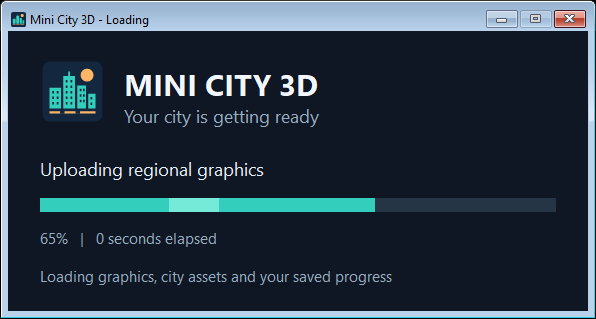

# Startup feedback and executable icon — 2026-09-28

## Verification

- Release `MiniCity3D` and `startup_smoke` built with MSVC through CMake/Ninja.
- `startup_smoke`, `asset_smoke`, `texture_mips_smoke`, and `probe_smoke`: 4/4 passed.
- Loading preview below was captured by `startup_smoke` using the same native loading-window code as the game; its layout was visually inspected.
- The actual game created its loading window after 0.031 seconds in the normal startup check. This check launched with Windows' hidden startup flag, so visibility was checked separately by `startup_smoke`.
- Actual-game cancellation exited cleanly after 0.115 seconds; a subsequent launch reached ready, dismissed its loader, and closed normally with exit code 0.
- Root `MiniCity3D.exe` matches the tested executable's SHA-256: `0DD0B2AFFFE107B20476E0FDE2F62CCCFE374AA6F73BB4DCE24C3ADF9B53F22C`.
- Windows successfully extracted the icon from the updated root executable. Tests loaded the embedded icon at 16, 24, 32, 48, 64, 128, and 256 pixels.

## Measured startup

One local normal startup on the AMD Radeon 680M development machine:

| Stage | Seconds |
| --- | ---: |
| Direct3D device | 0.050 |
| Graphics shader compilation | 1.388 |
| Buffers and shadows | 0.973 |
| Surface textures | 1.174 |
| Models and animation | 0.627 |
| Static geometry | 0.002 |
| Regional graphics upload and texture preparation | 15.354 |
| HDR lighting | 0.017 |
| Audio and settings | 0.444 |
| Gameplay data | 0.002 |
| City and physics world | 0.013 |
| Saved progress | 1.501 |
| First frame | 0.224 |
| Total to ready | 21.774 |

The loading indicator provides immediate feedback; it does not reduce the existing preload workload. Per-stage timings are written beside the executable in `MiniCity3D.log`. Hardware, cache state, and competing load affect these measurements.

